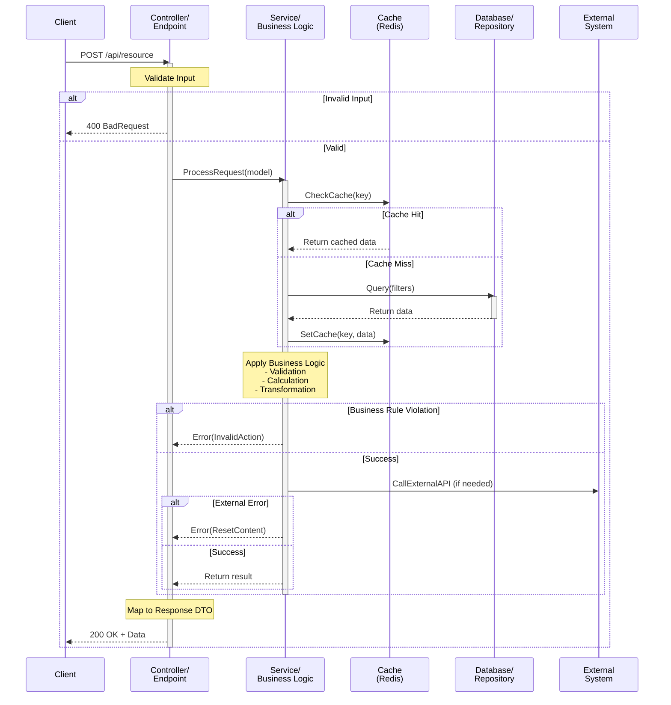

# API Documentation Generator

## Overview

This skill automates the creation of professional, standards-compliant API documentation from C# source code. It analyzes Controllers, Services, DTOs, and Repositories to produce comprehensive technical specifications with visual flow diagrams.

**Output**: Markdown documentation with API Specification and Logic Flow sections.

## When to Use

✅ **Use this skill when:**
- Documenting new API endpoints or services
- Creating technical specifications for internal/external stakeholders
- Analyzing business logic workflows and data flows
- Generating API reference materials for integration guides
- Ensuring consistent API documentation standards across the project

❌ **Don't use for:**
- Code refactoring or debugging (unrelated to documentation)
- General code questions or explanations
- Non-C# projects or non-API code analysis

## Procedure

### Phase 1: Code Analysis & Collection

1. **Identify Target Files**
   - Request file paths for Controllers (contains `[HttpGet/Post/Put/Delete]`)
   - Request Services files that implement business logic
   - Request DTO/Request/Response models referenced by endpoints
   - Optional: Repository files for database-related notes

2. **Extract Core Information**
   - **Endpoints**: Method name, HTTP verb, route path, [Authorize] attributes
   - **Parameters**: Input models, query params, route params with DataAnnotations
   - **Responses**: Success models (200, 201), error codes (4xx, 5xx)
   - **Business Logic**: Service method calls, validation rules, external dependencies
   - **Dependencies**: Redis, SQL, third-party APIs, cache layers

3. **Validation Checkpoint**
   - Confirm endpoint extraction count
   - Verify all DTOs and models are documented
   - Note any missing or unclear authorization attributes

### Phase 2: API Specification Documentation

For each endpoint, document:

#### **Section 2.1: Endpoint Header**
```
## Endpoint: [METHOD] /api/path/to/resource
```

#### **Section 2.2: Metadata**
Create a summary table:
| Property | Value |
|----------|-------|
| **Summary** | Business purpose in 1-2 sentences |
| **Auth Type** | JWT / API Key / None |
| **Required Roles** | [From Authorize attributes] |
| **HTTP Method** | GET / POST / PUT / DELETE / PATCH |
| **Route** | /api/v1/endpoint |

#### **Section 2.3: Request Documentation**
Create parameter table:
| Field | Type | Required | Description |
|-------|------|----------|-------------|
| `fieldName` | `string` | Yes/No | Purpose and validation rules from DataAnnotations |

**Request Example (JSON)**:
```json
{
  "fieldName": "value",
  "numericField": 0
}
```

#### **Section 2.4: Response Documentation**

**Success Response (200/201)**:
```json
{
  "statusCode": "Success",
  "data": {
    "id": 123,
    "name": "Resource name"
  },
  "errorMessage": null
}
```

| Field | Type | Description |
|-------|------|-------------|
| `statusCode` | `enum` | CRUDStatusCodeRes value |
| `data` | `object` | Response payload structure |
| `errorMessage` | `string` | Null on success |

**Error Responses (4xx, 5xx)**:
Create table for each error scenario:
| HTTP Code | Condition | Response |
|-----------|-----------|----------|
| 400 | Invalid input | `{statusCode: "InvalidInput", errorMessage: "..."}` |
| 404 | Resource not found | `{statusCode: "ResourceNotFound", errorMessage: "..."}` |
| 401 | Unauthorized | `{statusCode: "Unauthorized", errorMessage: "Access denied"}` |
| 500 | Server error | `{statusCode: "InternalServerError", errorMessage: "..."}` |

#### **Section 2.5: Error Codes Reference**
List all possible error codes with causes:
```
- ResourceNotFound: Resource with given ID does not exist
- InvalidInput: Validation failed on required field
- InvalidAction: Business rule violation
- ResetContent: External dependency failure (cache, redis, db)
```

### Phase 3: Logic Flow Visualization (Mermaid)

#### **Section 3.1: Sequence Diagram Template**

Create a Mermaid sequenceDiagram showing data flow:



**Key Elements to Include:**
- All actors (Client, Controller, Service, Cache, DB, External systems)
- Validation gates (alt/else for invalid input)
- Cache checking patterns
- Database queries
- External service calls
- Error branches
- Data transformation steps
- Response mapping

### Phase 4: Operational Notes

Document for each endpoint:

**Dependencies:**
- Redis cache keys used (if any)
- Database tables/procedures (if any)
- Third-party services/APIs called
- Configuration settings

**Performance Considerations:**
- Async/await patterns used
- Batch operations (if applicable)
- Caching TTL and refresh strategies
- Query optimization notes

**Concurrency & Edge Cases:**
- Thread-safety concerns
- Rate limiting (if applicable)
- Bulk operation limits
- Fallback behaviors

## Output Format Standards

### Markdown Structure
```
# [Feature/Module] API Documentation

## Overview
Brief module description and purpose.

## API Endpoints

### Endpoint: GET /api/resources
[Complete endpoint documentation]

### Endpoint: POST /api/resources  
[Complete endpoint documentation]

## Logic Flows

### Flow: Create Resource
[Mermaid sequenceDiagram]

### Flow: Update with Cache Invalidation
[Mermaid sequenceDiagram]

## Error Handling Strategy
Centralized error code mapping.

## Dependencies & Infrastructure
- Redis: [Keys & TTL]
- Database: [Tables & SPs]
- External: [Services & Timeouts]

## Performance Notes
- Caching: [Strategy & Duration]
- Async Patterns: [Usage Details]
- Bulk Operations: [Limits & Batching]
```

### Code Formatting
- **JSON examples**: Use triple backticks with `json` language
- **Mermaid diagrams**: Use triple backticks with `mermaid` language
- **Tables**: Use standard Markdown tables with pipe separators
- **Field descriptions**: Use backticks for `FieldName` references

## Quality Checklist

Before finalizing documentation:

- [ ] ✅ All endpoints documented (GET, POST, PUT, DELETE, PATCH)
- [ ] ✅ Authorization attribute extracted for each endpoint
- [ ] ✅ Request parameters match controller method signature
- [ ] ✅ Response models match DTO structures
- [ ] ✅ Error codes traced from service implementation
- [ ] ✅ All external dependencies (cache, db, APIs) identified
- [ ] ✅ Sequence diagram covers happy path + error paths
- [ ] ✅ JSON examples are valid and realistic
- [ ] ✅ Table formatting is consistent
- [ ] ✅ No placeholder or TODO sections remain

## Common Patterns to Document

### Pattern 1: Create with Cache Invalidation
Document how creation triggers cache refresh for downstream reads.

### Pattern 2: Get with Cache Warmup
Document cache-first pattern with DB fallback.

### Pattern 3: Batch Operations  
Document pagination, batch size limits, response structure.

### Pattern 4: Async Processing
Document callback patterns, webhook handlers, status polling.

### Pattern 5: Search/Filter
Document filter operators, sorting, pagination, response sorting.

## Example Usage

**Invoke this skill with:**
```
/api-documentation-generator

Analyze these files:
- Controllers/PromotionComboController.cs
- Services/PromotionComboService.cs
- DTOs/PromotionComboDto.cs

Generate: Complete API specification with sequence diagrams
```

## Tips & Tricks

1. **For complex flows**: Create separate sequence diagrams per variant (happy path, error path, cache scenarios)
2. **For large endpoint sets**: Group by feature/module in separate markdown files
3. **For external APIs**: Add timeout and retry policies to sequence diagram notes
4. **For async operations**: Show callback/event-driven patterns explicitly
5. **For validation**: Document validation rules inline with parameter tables

## References

### External Standards
- OpenAPI/Swagger: Industry standard for API specs
- JSON:API: Standard for JSON API responses
- REST conventions: HTTP method semantics
- Mermaid sequence diagrams: Visual flow representation

### Internal Templates
See `./templates/` folder for:
- `endpoint-template.md` - Single endpoint documentation template
- `sequence-diagram-template.mmd` - Reusable diagram patterns
- `error-codes-reference.md` - Standard error codes mapping

### Best Practices
- [Microsoft REST API Guidelines](https://restfulapi.net/)
- [JSON API Specification](https://jsonapi.org/)
- [Mermaid Documentation](https://mermaid.js.org/)
