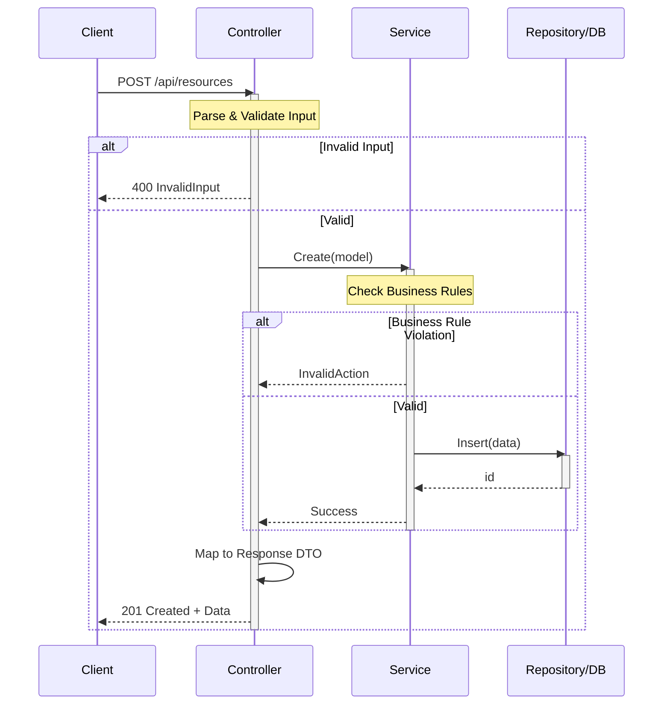
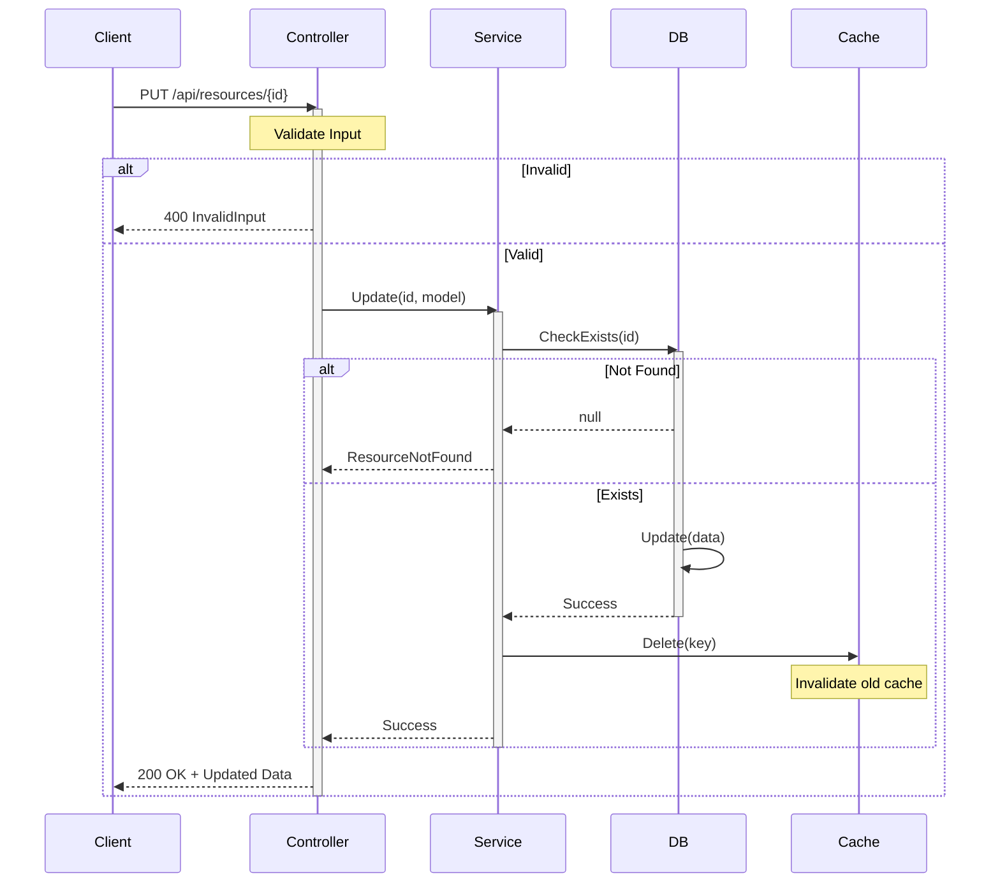
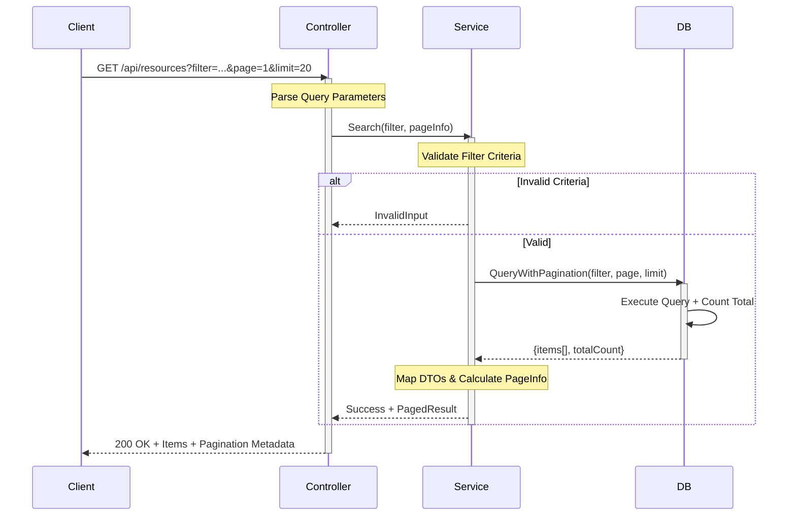
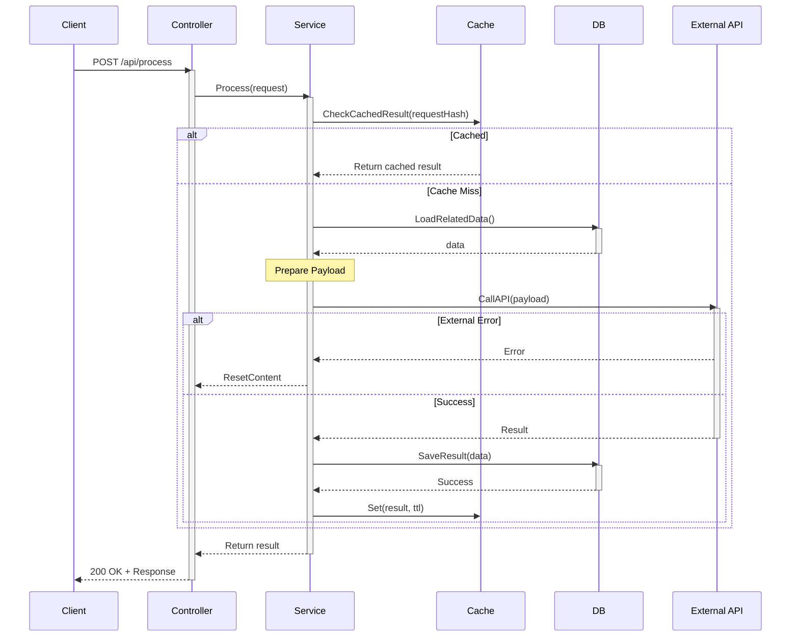
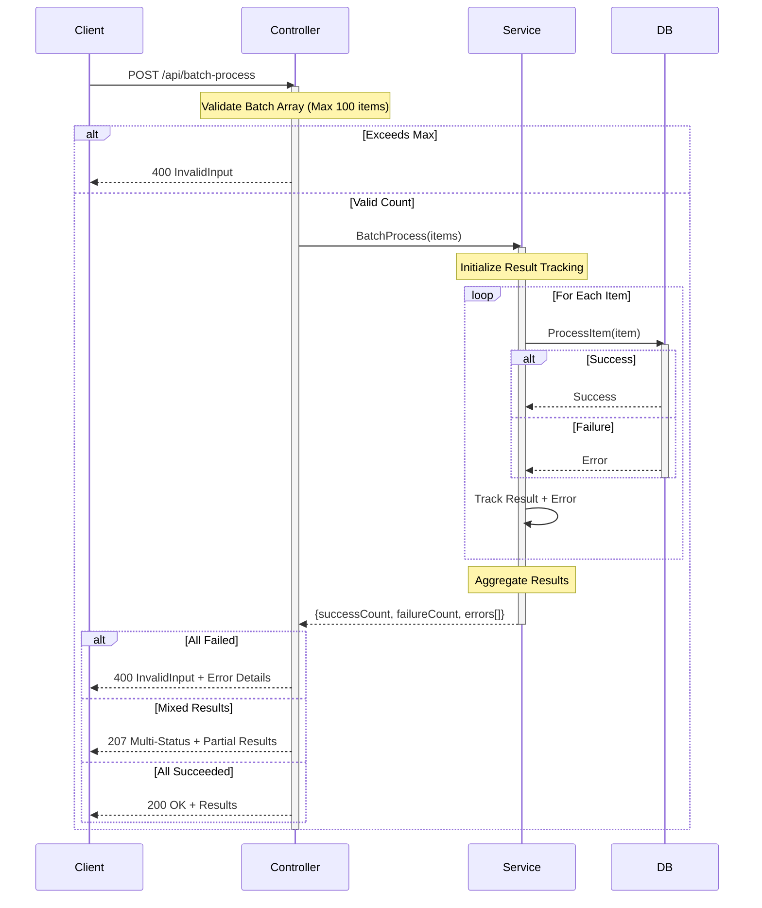
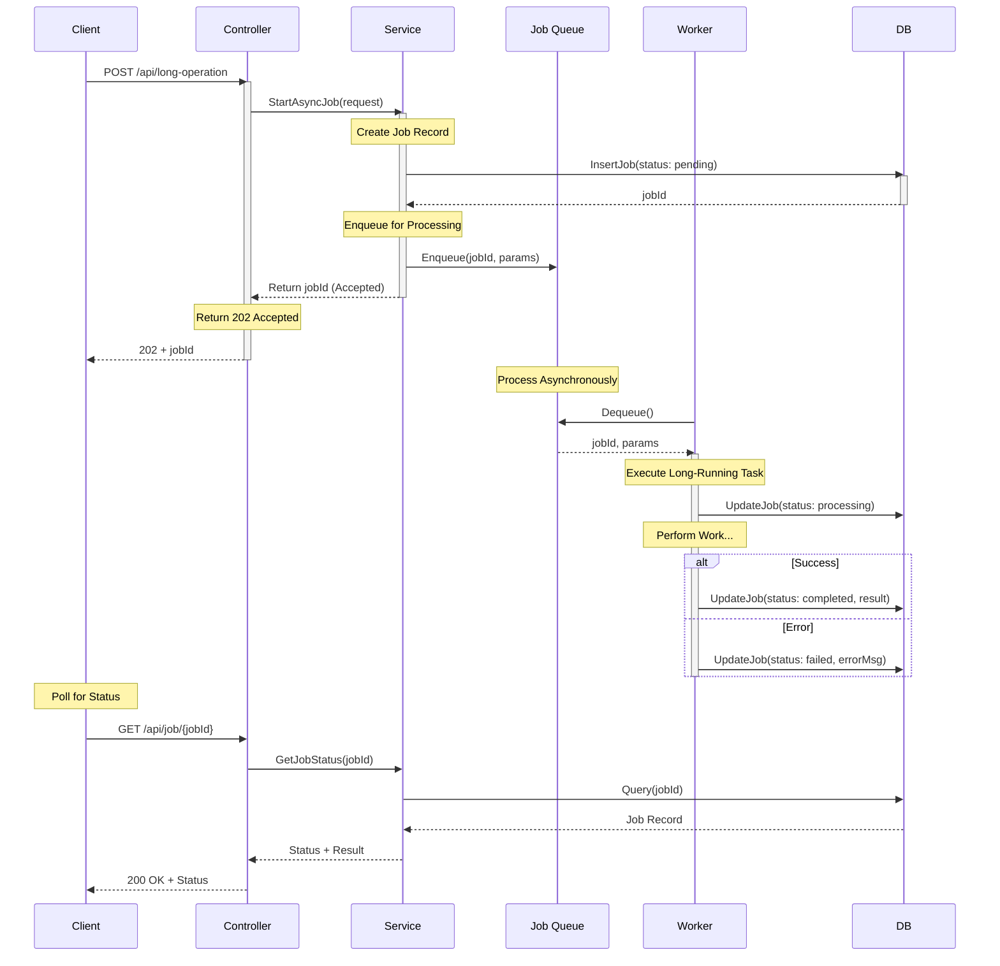

# Sequence Diagram Patterns & Template

Reference patterns for Mermaid sequenceDiagram in API documentation.

---

## Pattern 1: Simple CRUD (Create with Validation)



---

## Pattern 2: Read with Cache-First Strategy

```mermaid
sequenceDiagram
    participant Client
    participant Controller
    participant Service
    participant Cache as Cache/Redis
    participant DB
    
    Client->>Controller: GET /api/resources/{id}
    activate Controller
    
    Note over Controller: Extract ID Parameter
    Controller->>Service: GetById(id)
    activate Service
    
    Service->>Cache: Get(key)
    alt Cache Hit
        Cache-->>Service: Return cached data
        Note over Service: Data found in cache
    else Cache Miss
        Service->>DB: Query(id)
        activate DB
        alt Record Not Found
            DB-->>Service: null
            deactivate DB
            Service-->>Controller: ResourceNotFound
            Controller-->>Client: 404 Not Found
        else Found
            DB-->>Service: data
            deactivate DB
            Service->>Cache: Set(key, data, ttl)
            Note over Cache: Store for future requests
        end
    end
    
    Service-->>Controller: Return data
    deactivate Service
    
    Controller->>Controller: Map to Response DTO
    Controller-->>Client: 200 OK + Data
    deactivate Controller
```

---

## Pattern 3: Update with Cache Invalidation



---

## Pattern 4: Search/Filter with Pagination



---

## Pattern 5: Complex Operation with External Service Call



---

## Pattern 6: Batch Operation with Partial Success



---

## Pattern 7: Async Processing with Callback



---

## Common Elements to Include

### Activation Boxes
- Start with `activate [Actor]`
- End with `deactivate [Actor]`
- Shows when component is active/processing

### Notes
```
Note over Component: Description of what's happening
```

### Alternatives (Decision branching)
```
alt Condition 1
    [Happy Path]
else Condition 2
    [Alternative Path]
else
    [Fallback Path]
end
```

### Loops
```
loop For Each Item
    [Repeated Action]
end
```

### Parallel Operations
```
par Task 1
    [Action 1]
and Task 2
    [Action 2]
end
```

### Break (Exit sequence)
```
break When Condition True
    [Terminating Action]
    Note over: Stop here
end
```

---

## Best Practices

1. **Keep diagrams focused**: One flow per diagram (happy path, error path separate)
2. **Show all actors**: Client, API, Service, Cache, DB, External systems
3. **Include validation gates**: Use alt/else to show rejection paths
4. **Label transitions**: Use descriptive method names and parameters
5. **Add notes**: Explain non-obvious processing steps
6. **Represent errors**: Show error responses and fallback behaviors
7. **Show caching patterns**: explicit Get/Set operations to Cache
8. **Order by dependency**: Left to right typically follows data flow
9. **Keep timing implicit**: Mermaid adds time progression automatically

---

## Mermaid Reference

For more details, see: [Mermaid Sequence Diagram Docs](https://mermaid.js.org/syntax/sequenceDiagram.html)
