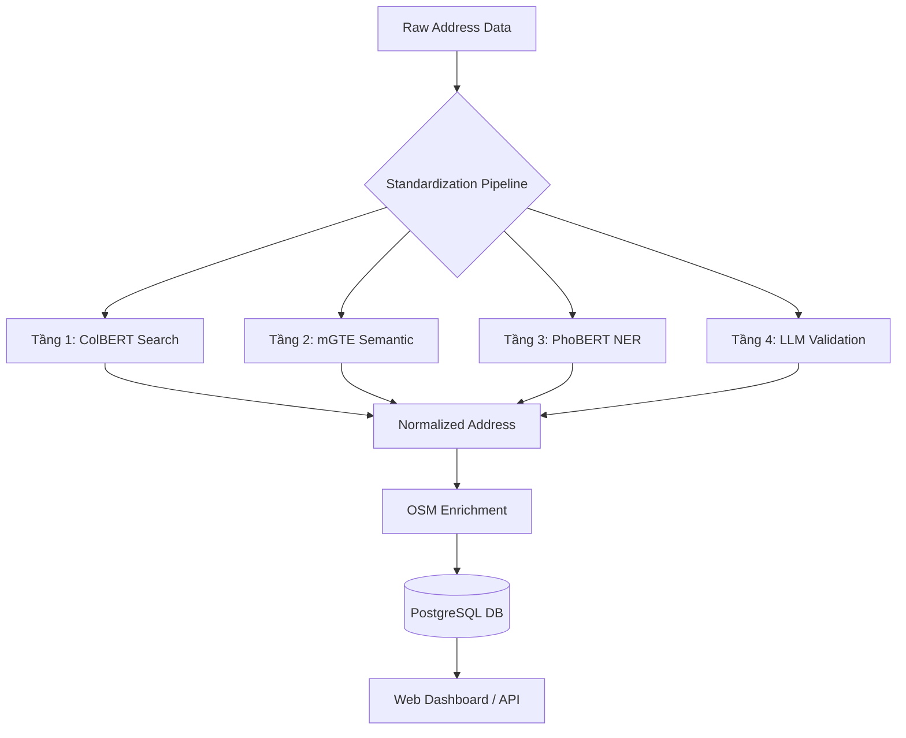

# 🇻🇳 VN Address Intelligence (VNAI)

[](https://www.python.org/)
[](https://fastapi.tiangolo.com/)
[](LICENSE)
[](#tech-stack)

> **Hệ thống AI hiện đại chuyên biệt cho việc chuẩn hóa, làm giàu và quản trị dữ liệu địa chỉ Việt Nam.** Giải pháp tối ưu cho bài toán biến động hành chính 2025, kết hợp sức mạnh của NLP và dữ liệu không gian (Geospatial).

---

## 🌟 Tính năng nổi bật (Key Features)

- 🤖 **AI-Powered Address Parsing**: Tự động bóc tách các thành phần địa chỉ (Số nhà, Tên đường, Phường/Xã...) bằng các mô hình học sâu tiên tiến (PhoBERT, mGTE, LLM Qwen).
- 🗺️ **Administrative Mapping 2025**: Hệ thống đầu tiên hỗ trợ đầy đủ các kịch bản sáp nhập và thay đổi đơn vị hành chính theo Nghị quyết Chính phủ 2025 (Admin V2).
- 📍 **Geospatial Enrichment**: Tích hợp dữ liệu thực địa từ OpenStreetMap (OSM) với hơn 1.35 triệu bản ghi (đường phố, tòa nhà, POI).
- 🗺️ **Boundary Visualization & Analysis**: Tích hợp công cụ hiển thị và phân tích ranh giới hành chính (maps, polygon expansion, mismatch visualization).
- 📊 **Performance Benchmarking**: Công cụ so sánh hiệu năng (F1-Score, Throughput, Cost) giữa các dòng mô hình AI khác nhau.
- 💻 **Real-time Dashboard**: Giao diện quản trị hiện đại (Linear Design System) hỗ trợ Dark Mode và trực quan hóa luồng dữ liệu.
- 🚀 **High Throughput**: Tối ưu hóa pipeline xử lý, đạt tốc độ ≥ 20 địa chỉ/giây với chi phí vận hành cực thấp so với Cloud API.

---

## 🛠️ Công nghệ sử dụng (Tech Stack)

| Thành phần | Công nghệ |
|---|---|
| **Backend** | Python 3.11+, FastAPI, Uvicorn |
| **Database** | PostgreSQL (v14+), SQLAlchemy, GeoJSON support |
| **AI/ML Models** | PhoBERT (NER), mGTE (Siamese), LLM Qwen3 |
| **AI Frameworks** | Hugging Face Transformers, PyTorch, Sentence-Transformers |
| **Frontend** | Vanilla JS, CSS (Linear Design System), HTML5 |
| **Data Tools** | Overpass API (OSM), Pandas, PyVi, Scikit-learn |
| **CLI/Automation** | Click, TQDM, Logstash-async |

---

## 🏗️ Kiến trúc & Luồng dữ liệu

Dự án được xây dựng theo mô hình pipeline đa tầng, đảm bảo tính chính xác và hiệu năng:



---

## 📁 Cấu trúc dự án (Project Structure)

```text
vn-address-intelligence/
├── app/                    # Mã nguồn Backend & AI logic
│   ├── ai/                 # Huấn luyện & triển khai mô hình (PhoBERT, Siamese...)
│   ├── api/                # FastAPI Endpoints & Web Server
│   ├── core/               # Cấu hình hệ thống & Kết nối DB (SQLAlchemy)
│   ├── services/           # Nghiệp vụ: OSM Fetcher, Data Cleansing
│   ├── tools/               # Tiện ích nghiệp vụ dùng chung
│   │   └── boundary_visualization/  # Boundary map helpers tích hợp từ project phụ
│   └── main.py              # CLI Entry Point (init_db, seed, fetch_osm)
├── ui/                     # Giao diện Frontend (SaaS Dashboard)
├── data/                   # Dữ liệu mẫu (Seed CSV), Huấn luyện & Export
├── docs/                   # Tài liệu nghiên cứu & Đặc tả hệ thống
├── scripts/                # Script bảo trì, trích xuất dữ liệu & reporting
├── reports/                # Kết quả đánh giá model & experiment
├── start.py                # Wrapper script khởi chạy nhanh
└── requirements.txt        # Danh sách thư viện phụ thuộc
```

---

## 🚀 Bắt đầu (Getting Started)

### 1. Yêu cầu hệ thống (Prerequisites)
- **Python**: Phiên bản 3.11 trở lên.
- **Database**: PostgreSQL 14+ (Yêu cầu quyền tạo database và schema).
- **Phần cứng**: RAM tối thiểu 16GB (khuyên dùng để chạy các mô hình AI local).

### 2. Cài đặt (Installation)

```bash
# 1. Clone repository
git clone https://github.com/your-username/vn-address-intelligence.git
cd vn-address-intelligence

# 2. Tạo môi trường ảo và cài đặt thư viện
python -m venv .venv
source .venv/bin/activate  # Hoặc .venv\Scripts\activate trên Windows
pip install -r requirements.txt

# 3. Cấu hình môi trường
cp .env.example .env
# Chỉnh sửa thông tin DATABASE_URL và API Keys trong file .env
```

### 3. Thiết lập Database & Dữ liệu

```bash
# Khởi tạo Schema và Tables
python -m app.main init_db

# Import dữ liệu hành chính (Master Data)
python -m app.main seed_master data/seed

# Cập nhật ánh xạ hành chính 2025 (Admin V2)
python -m app.main seed_v2

# Thu thập dữ liệu địa chỉ thực địa từ OSM
python -m app.main fetch_osm --limit 1000 --target 5000000
```

### 4. Khởi chạy ứng dụng

```bash
# Chạy Web Server (API & Dashboard)
python start.py serve-ui

# Hoặc dùng uvicorn trực tiếp
uvicorn app.api.server:app --port 8081 --reload
```
Truy cập giao diện tại: `http://localhost:8081`

---

## 🔌 API & Sử dụng (Usage)

### Các Endpoint chính:
- `GET /api/provinces`: Lấy danh sách tỉnh/thành phố.
- `POST /api/parser/analyze`: Phân tích địa chỉ thô bằng AI (So sánh 3 model).
- `GET /api/lookup/mapping`: Tra cứu lịch sử sáp nhập đơn vị hành chính.
- `POST /api/benchmark/trigger`: Khởi chạy đánh giá hiệu năng mô hình.
- `GET /api/boundary/map`: Sinh bản đồ polygon hành chính từ CSDL và trả về URL HTML trong `ui/pages/`.

### Ví dụ CLI:
```bash
# Kiểm tra sức khỏe database
python start.py check-db

# Trích xuất báo cáo minh chứng
python scripts/reporting/export_evidence.py

# Mở trang ranh giới hành chính
# Sau khi chạy server, vào /ui/index.html rồi chọn "Ranh giới hành chính"
```

---

## 🤝 Đóng góp (Contributing)

Chúng tôi hoan nghênh mọi sự đóng góp để hoàn thiện hệ thống. Vui lòng:
1. Fork dự án.
2. Tạo Branch mới (`git checkout -b feature/AmazingFeature`).
3. Commit thay đổi (`git commit -m 'Add some AmazingFeature'`).
4. Push lên Branch (`git push origin feature/AmazingFeature`).
5. Mở một Pull Request.

---

## 📄 Giấy phép (License)

Dự án này được cấp phép theo Giấy phép MIT - xem file [LICENSE](LICENSE) để biết thêm chi tiết.

---
**VN Address Intelligence** - *Giải pháp thông minh cho dữ liệu địa chỉ Việt Nam.*
Phát triển bởi: **Nguyễn Vũ Trọng Giang** (MIS - 2470279)
Updated: 2026-05-01
