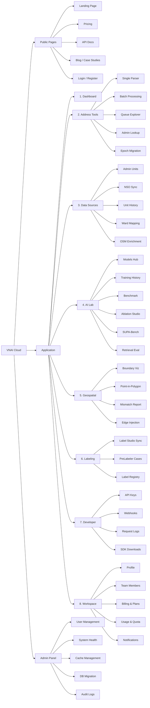
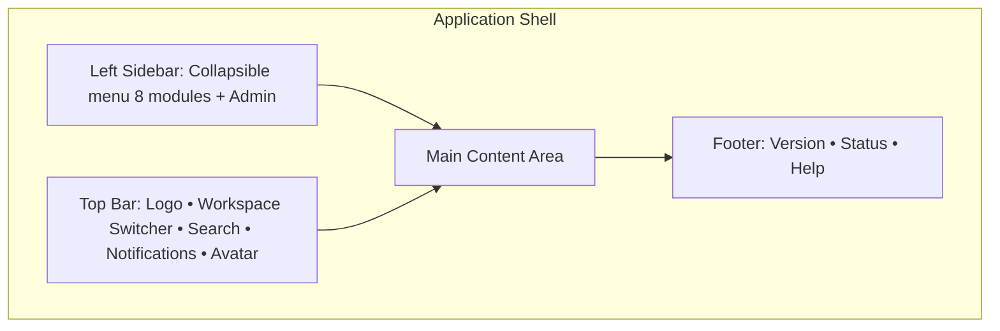
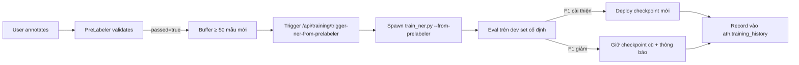
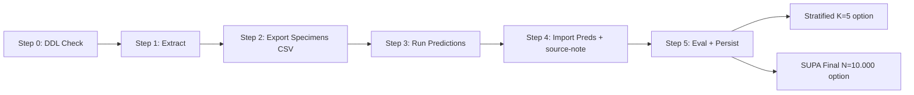
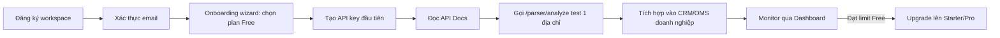
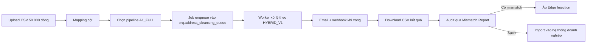
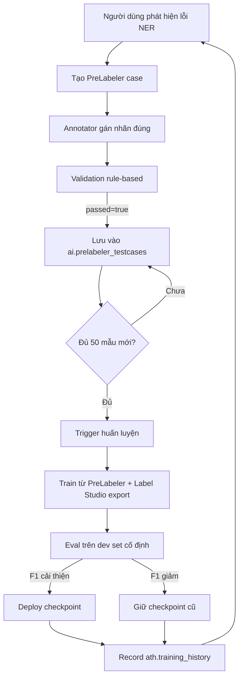
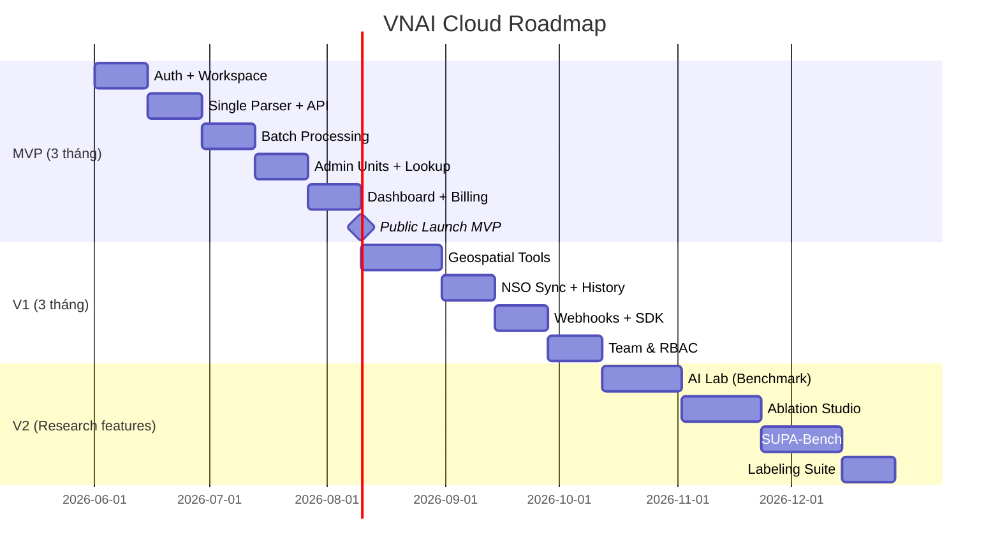

# Đặc tả tính năng SaaS — VN Address Intelligence (VNAI)

> Tài liệu thiết kế sản phẩm SaaS thương mại hoá kết quả nghiên cứu Đồ án Tốt nghiệp 2026. Tài liệu này độc lập với mã nguồn LaTeX của luận văn, chỉ phục vụ thiết kế UI/UX và roadmap sản phẩm.
>
> **Phiên bản:** 1.0 — Mốc 2026-05-17
> **Nền tảng tham chiếu:** kiến trúc VNAI bốn module, pipeline HYBRID_V1, khung SUPA-Bench, kết quả ablation A1_FULL (EM@v2 = 66,58%).

---

## 1. Tổng quan sản phẩm

**Tên sản phẩm:** VNAI Cloud — *Vietnam Address Intelligence as a Service*

**Định vị:** Nền tảng SaaS chuẩn hoá, làm giàu và xác thực địa chỉ Việt Nam dành cho doanh nghiệp logistics, thương mại điện tử, ngân hàng, bảo hiểm và cơ quan hành chính công, trong bối cảnh cải cách hành chính 2025.

**Đối tượng người dùng (personas):**

| Persona | Mô tả | Nhu cầu chính |
|---------|-------|---------------|
| **Developer / Tích hợp viên** | Lập trình viên backend tích hợp API vào CRM/OMS doanh nghiệp | API key, SDK, tài liệu, sandbox, webhook |
| **Vận hành dữ liệu** | Data analyst, data engineer phụ trách chất lượng dữ liệu địa chỉ | Batch upload, dashboard chất lượng, audit log |
| **Quản trị nghiệp vụ** | Trưởng phòng vận hành, CTO | Tổng quan, báo cáo, billing, quản lý team |
| **Nhà nghiên cứu / Annotator** | Người gán nhãn dữ liệu, kiểm thử mô hình | Label Studio, PreLabeler, training history |
| **Quản trị viên hệ thống** | Admin nội bộ VNAI | Quản lý user, sức khoẻ hệ thống, áp migration |

---

## 2. Sơ đồ menu tổng thể



**Triết lý gom nhóm:**

- **Address Tools** — thao tác hàng ngày trên địa chỉ đơn lẻ hoặc hàng loạt.
- **Data Sources** — quản lý dữ liệu master và nguồn ngoài.
- **AI Lab** — không gian dành cho data scientist/researcher.
- **Geospatial** — các tính năng dựa trên PostGIS và polygon.
- **Labeling** — vòng phản hồi gán nhãn → huấn luyện liên tục.
- **Developer** — công cụ tích hợp.
- **Workspace** — quản lý tổ chức/team.
- **Admin Panel** — chỉ hiển thị với super admin.

---

## 3. Phân quyền theo vai trò (RBAC)

| Module | Viewer | Operator | Developer | Admin | SuperAdmin |
|--------|:------:|:--------:|:---------:|:-----:|:----------:|
| Dashboard | ✓ | ✓ | ✓ | ✓ | ✓ |
| Address Tools (Parser, Lookup) | ✓ | ✓ | ✓ | ✓ | ✓ |
| Batch Processing | — | ✓ | ✓ | ✓ | ✓ |
| Queue Explorer | ✓ | ✓ | ✓ | ✓ | ✓ |
| Data Sources (xem) | ✓ | ✓ | ✓ | ✓ | ✓ |
| NSO Sync (kích hoạt) | — | — | — | ✓ | ✓ |
| AI Lab (xem) | ✓ | ✓ | ✓ | ✓ | ✓ |
| AI Lab (chạy benchmark) | — | — | ✓ | ✓ | ✓ |
| Geospatial Tools | ✓ | ✓ | ✓ | ✓ | ✓ |
| Labeling | — | ✓ | ✓ | ✓ | ✓ |
| Developer Portal | — | — | ✓ | ✓ | ✓ |
| Workspace (billing) | — | — | — | ✓ | ✓ |
| Admin Panel | — | — | — | — | ✓ |

---

## 4. Layout chung (Application Shell)



**Quy ước layout chuẩn của một trang chức năng:**

1. **Page Header:** breadcrumb + tiêu đề + mô tả ngắn + nút hành động chính (CTA).
2. **Filter / Toolbar:** bộ lọc, tìm kiếm, chuyển chế độ xem (table/grid/map).
3. **Content Area:** bảng / form / map / chart tuỳ tính năng.
4. **Side Panel (tuỳ chọn):** chi tiết bản ghi đang chọn, dạng drawer trượt phải.
5. **Empty State:** hình minh hoạ + hướng dẫn bước đầu khi chưa có dữ liệu.

---

## 5. Đặc tả chi tiết từng module

### 5.1. Module Authentication & Onboarding

**Vị trí menu:** Public Pages → Login / Register (trước khi vào App).

**Tính năng con:**

| # | Tính năng | Mô tả |
|---|-----------|-------|
| 1.1 | Đăng ký 2 bước | Email → mã xác thực 6 số → tạo workspace |
| 1.2 | Đăng nhập | Username/email + password, JWT 60 phút |
| 1.3 | Đăng nhập SSO | Google / Microsoft (V2) |
| 1.4 | Quên mật khẩu | Email reset link |
| 1.5 | Onboarding wizard | 4 bước: workspace name → plan → invite team → API key đầu tiên |

**Layout đăng ký:**

```
┌─────────────────────────────────────────────────────┐
│  [Logo VNAI]                                         │
├─────────────────────────────────────────────────────┤
│                                                      │
│   Bước 1 / 2: Nhập email                            │
│   ┌──────────────────────────────────────┐          │
│   │ giang@example.com                     │          │
│   └──────────────────────────────────────┘          │
│   [Gửi mã xác thực →]                                │
│                                                      │
│   Đã có tài khoản? Đăng nhập                        │
└─────────────────────────────────────────────────────┘
```

**Input → Process → Output:**

- **Input:** email → mã 6 số → mật khẩu + tên workspace.
- **Process:** lưu vào `ath.email_verifications` (TTL 15 phút) → bcrypt hash → cấp JWT.
- **Output:** chuyển vào Dashboard với workspace mặc định và free quota.

---

### 5.2. Module Dashboard (Tổng quan)

**Vị trí menu:** App → Dashboard.

**Mục tiêu:** trang khởi đầu sau khi đăng nhập, hiển thị tình trạng workspace.

**Layout:**

```
┌────────────────────────────────────────────────────────────┐
│  Dashboard                                  [Refresh] [⚙]  │
├────────────────────────────────────────────────────────────┤
│ KPI Cards (4 ô):                                            │
│ ┌──────────┐ ┌──────────┐ ┌──────────┐ ┌──────────┐        │
│ │Requests  │ │ Quota    │ │ Pending  │ │ EM@v2    │        │
│ │ 12.430   │ │ 87.570/  │ │ Queue    │ │ 66,58%   │        │
│ │ ↑ 12%    │ │ 100.000  │ │ 1.243    │ │ A1_FULL  │        │
│ └──────────┘ └──────────┘ └──────────┘ └──────────┘        │
├────────────────────────────────────────────────────────────┤
│ Biểu đồ Requests theo ngày (7/30/90 ngày)                  │
│ ████████████████████░░░░░░ chart line                       │
├────────────────────────────────────────────────────────────┤
│ Trạng thái hệ thống:           │  Hoạt động gần đây:        │
│  • PhoBERT NER: ✓ healthy      │  • Batch #1024: done       │
│  • mGTE Retrieval: ✓ healthy   │  • NSO sync: 12 changes    │
│  • LLM Qwen 1.5B: ✓ healthy    │  • OSM job: 80% complete   │
│  • PostGIS: ✓ available        │                            │
└────────────────────────────────────────────────────────────┘
```

**Input → Process → Output:**

- **Input:** workspace_id (từ JWT).
- **Process:** truy vấn `prq.address_cleansing_queue` đếm PENDING, đọc usage từ `auth_users` join với billing, lấy health từ `/api/parser/status`.
- **Output:** 4 KPI + 1 biểu đồ thời gian + bảng trạng thái + activity feed.

---

### 5.3. Module Address Tools

#### 5.3.1. Single Address Parser

**Vị trí menu:** App → Address Tools → Single Parser.

**Mục tiêu:** chuẩn hoá một địa chỉ đơn lẻ, hiển thị kết quả từ bốn mô hình song song để so sánh.

**Layout:**

```
┌────────────────────────────────────────────────────────────┐
│ Single Address Parser                                       │
├────────────────────────────────────────────────────────────┤
│ Input:                                                      │
│ ┌────────────────────────────────────────────────────────┐ │
│ │ 268 Lý Thường Kiệt, P14, Q10, TPHCM                    │ │
│ └────────────────────────────────────────────────────────┘ │
│ [Cấu hình ▼: A1_FULL / chỉ NER / chỉ Retrieval / Chọn LLM] │
│ [Phân tích →]                                               │
├────────────────────────────────────────────────────────────┤
│ Kết quả (Tab):                                              │
│ ┌─[AddressNER]──[PhoBERTSiamese]──[SiameseMGTE]──[LLM]─┐  │
│ │                                                        │  │
│ │ Đường:    Lý Thường Kiệt                              │  │
│ │ Số nhà:   268                                          │  │
│ │ Phường:   Phường 14  (mã: 27262)                      │  │
│ │ Quận:     Quận 10    (mã: 771)                        │  │
│ │ Tỉnh:     TP. Hồ Chí Minh (mã: 79)                    │  │
│ │ ─────────────────────────────────────                  │  │
│ │ Confidence: 0.94 | ACS: 0.91 | Epoch: POST_2025       │  │
│ │ Latency: 9.5 ms                                        │  │
│ └──────────────────────────────────────────────────────┘  │
│ [Map preview với marker tại 10.7713, 106.6589]             │
└────────────────────────────────────────────────────────────┘
```

**Input → Process → Output:**

- **Input:** chuỗi địa chỉ thô + cấu hình pipeline.
- **Process:** `POST /api/parser/analyze` → AddressNER bóc tách → SiameseMGTE retrieve top-k → LLMQwen3 tinh chỉnh → tính ACS, epoch.
- **Output:** JSON cấu trúc 5 trường (street, ward, district, province, full_address) + confidence + latency cho từng mô hình.

#### 5.3.2. Batch Processing

**Vị trí menu:** App → Address Tools → Batch Processing.

**Mục tiêu:** chuẩn hoá hàng loạt từ CSV/Excel hoặc qua API trigger.

**Layout 3 tab:**

- **Tab Upload:** drag-drop CSV/XLSX, mapping cột (raw_address, optional: lat/lng, ward_id), chọn pipeline (A1_FULL recommended), nút Start.
- **Tab Jobs:** bảng job đang chạy với progress bar (xử lý 1.234/5.000), status (RUNNING, DONE, FAILED), thời gian bắt đầu/dự kiến kết thúc.
- **Tab History:** danh sách job đã chạy, link xuất CSV kết quả + manifest JSON provenance.

**Input → Process → Output:**

- **Input:** file CSV/XLSX (≤ 100k dòng / tier Pro), mapping cột, pipeline config.
- **Process:** validate → enqueue vào `prq.address_cleansing_queue` với status PENDING → worker batch xử lý → ghi `address_standardized`, ACS, epoch → tạo job manifest.
- **Output:** file CSV kết quả + email thông báo + webhook callback (nếu cấu hình).

#### 5.3.3. Queue Explorer

**Vị trí menu:** App → Address Tools → Queue Explorer.

**Mục tiêu:** duyệt và lọc các bản ghi trong hàng đợi chuẩn hoá.

**Layout:** bảng pagination với filter (status, processing_method, ACS range, province, ngày), drawer chi tiết khi click row, hành động hàng loạt (re-process, mark resolved, export).

#### 5.3.4. Admin Lookup

**Vị trí menu:** App → Address Tools → Admin Lookup.

**Mục tiêu:** tra cứu nhanh thông tin đơn vị hành chính theo mã hoặc tên.

**Layout:** thanh search lớn ở giữa + autocomplete kết quả → click hiển thị card chi tiết (tên, mã, dân số, diện tích, lịch sử thay đổi, polygon preview).

#### 5.3.5. Epoch Migration

**Vị trí menu:** App → Address Tools → Epoch Migration.

**Mục tiêu:** chuyển đổi địa chỉ tiền cải cách (PRE_2025) sang định danh hậu cải cách (POST_2025).

**Layout:** form đơn lẻ tương tự Parser, kết quả hiển thị side-by-side "Trước cải cách" vs "Sau cải cách" với mũi tên biến đổi và quan hệ áp dụng (MERGES_INTO / RENAMES_TO / BOUNDARY_ADJUSTED).

---

### 5.4. Module Data Sources

#### 5.4.1. Admin Units (Tỉnh / Huyện / Xã)

**Vị trí menu:** App → Data Sources → Admin Units.

**Layout:** 3 tab Tỉnh/Huyện/Xã, mỗi tab là bảng có thể lọc theo `admin_version` (1 = pre, 2 = post), `is_active`, search theo tên. Click row mở drawer chi tiết với polygon mini-map và bảng lịch sử SCD.

**Input → Process → Output:**

- **Input:** filter parameters.
- **Process:** `GET /api/provinces`, `/districts/{id}`, `/wards/{id}` với cache Redis.
- **Output:** bảng pagination + drawer chi tiết.

#### 5.4.2. NSO Sync

**Vị trí menu:** App → Data Sources → NSO Sync (Admin/SuperAdmin only).

**Layout:**

```
┌────────────────────────────────────────────────────────────┐
│ NSO Sync — Đồng bộ danh mục hành chính từ Chính phủ        │
├────────────────────────────────────────────────────────────┤
│ [⚡ Sync toàn bộ]  [🎯 Sync theo tỉnh: TP.HCM ▼]           │
│                                                             │
│ Lần đồng bộ gần nhất: 2026-05-15 02:00 (NSO_API)           │
│ Bản ghi cập nhật: 12   |   Bản ghi mới: 3                  │
├────────────────────────────────────────────────────────────┤
│ Lịch sử sync (run_id):                                      │
│ ┌──────────────────────────────────────────────────────┐   │
│ │ run_id │ source       │ time      │ changes │ status │   │
│ │ #421   │ NSO_API      │ 02:00     │ 12      │ ✓ done │   │
│ │ #420   │ N8N_WORKFLOW │ 01h before│ 0       │ ✓ done │   │
│ └──────────────────────────────────────────────────────┘   │
│ [Xem chi tiết run_id #421 →]                                │
└────────────────────────────────────────────────────────────┘
```

**Input → Process → Output:**

- **Input:** trigger thủ công hoặc cron (n8n workflow).
- **Process:** gọi NSO API → so checksum SCD Type 2 → upsert vào `mat.province/district/ward` → ghi `mat.unit_edge` cho biến đổi → log vào `ath.sync_log`.
- **Output:** số bản ghi thay đổi + auto invalidate Redis cache đơn vị hành chính.

#### 5.4.3. Unit History (Lịch sử thay đổi)

**Layout:** chọn cấp + đơn vị → timeline dạng dọc hiển thị các phiên bản SCD (valid_from → valid_to), highlight các cạnh `unit_edge` (MERGES_INTO / SPLIT_FROM / RENAMES_TO / BOUNDARY_ADJUSTED).

#### 5.4.4. Ward Mapping

**Layout:** bảng `mat.ward_mapping` với cột old → new, relationship_type, effective_date, ghi chú. Cho phép export CSV.

#### 5.4.5. OSM Enrichment

**Layout:** bảng các job OSM (theo tỉnh), tổng số streets/buildings/pois đã thu thập, biểu đồ độ phủ theo tỉnh, nút trigger job mới.

---

### 5.5. Module AI Lab

#### 5.5.1. Models Hub

**Vị trí menu:** App → AI Lab → Models Hub.

**Layout:** grid card 4 model (PhoBERT NER, SiameseMGTE, LLMQwen3, Address Cleaner) — mỗi card hiển thị: checkpoint hash, F1, loss, ngày huấn luyện, nút Reload / Test / Deploy.

#### 5.5.2. Training History

**Vị trí menu:** App → AI Lab → Training History.

**Layout:**

- Bảng pagination các lần huấn luyện (`ath.training_history`).
- Cột: version, model, samples, F1, precision, recall, token_acc, eval_loss, git_commit, ngày.
- Click row → drawer chi tiết với biểu đồ loss/F1 theo step, link checkpoint, notes provenance (`prelabeler_cases=120;labelstudio_merged=0;...`).
- Nút "Trigger huấn luyện từ PreLabeler" nếu đủ ngưỡng mẫu mới đạt chuẩn.

**Flow huấn luyện liên tục:**



#### 5.5.3. Benchmark Studio

**Vị trí menu:** App → AI Lab → Benchmark.

**Layout:**

- Tab "Realtime" — biểu đồ live F1 và throughput trong khi benchmark đang chạy.
- Tab "Baselines" — bảng `ath.benchmark_model_baselines` (PhoBERT, mGTE, Qwen, Google Maps) với F1, throughput, cost/1M, google_match.
- Tab "Trigger" — form chọn dataset (D1–D5), model, sample_size → start benchmark.
- Tab "Results" — danh sách `benchmark_run_result` với UUID, model_key, ACS, decision, latency.

#### 5.5.4. Ablation Studio (★ Tính năng signature)

**Vị trí menu:** App → AI Lab → Ablation Studio.

**Mục tiêu:** chạy và so sánh các cấu hình pipeline (A1_FULL, A2_NER_TFIDF, A2_NER_MGTE, A3_MGTE_ONLY, A4_NER_LLM) hoặc cấu hình tuỳ chỉnh.

**Layout:**

```
┌──────────────────────────────────────────────────────────────┐
│ Ablation Studio                                               │
├──────────────────────────────────────────────────────────────┤
│ Step 1: Chọn cohort                                           │
│   N = [5000]  Profile = [SUP-1.0.0 ▼]  Seed = [auto/manual]  │
│                                                               │
│ Step 2: Định nghĩa các cấu hình so sánh                       │
│   ┌────────────────────────────────────────────────────┐    │
│   │ ☑ A1_FULL    [NER ✓][Retrieval: mGTE ▼][LLM ✓]    │    │
│   │ ☑ A2_TFIDF   [NER ✓][Retrieval: TFIDF ▼][LLM ☐]   │    │
│   │ ☑ A3_MGTE    [NER ☐][Retrieval: mGTE ▼][LLM ☐]    │    │
│   │ ☐ A4_NER_LLM [NER ✓][Retrieval: none ▼][LLM ✓]    │    │
│   │ + Thêm cấu hình tuỳ chỉnh                          │    │
│   └────────────────────────────────────────────────────┘    │
│                                                               │
│ Step 3: [▶ Chạy ablation] (ước tính 25 phút trên GPU T4)     │
├──────────────────────────────────────────────────────────────┤
│ Kết quả so sánh (sau khi chạy):                              │
│ ┌────────────────────────────────────────────────────┐      │
│ │ Bar chart EM@v2 theo cấu hình                      │      │
│ │ ████████████████████ A1_FULL  66.58%               │      │
│ │ █████████████████░░░ A2_TFIDF 60.98%               │      │
│ │ █████████████████░░░ A3_MGTE  60.98%               │      │
│ │ ██░░░░░░░░░░░░░░░░░░ A4_NL    8.46%                │      │
│ └────────────────────────────────────────────────────┘      │
│ [📥 Export JSON aggregate] [📊 Xem F1 thành phần] [📋 Persist]│
└──────────────────────────────────────────────────────────────┘
```

**Input → Process → Output:**

- **Input:** N, profile, seed, danh sách cấu hình.
- **Process:** với mỗi cấu hình → `extract --n N --seed S` → chạy pipeline tương ứng → import preds → `eval` → ghi `ath.ablation_run`.
- **Output:** JSON aggregate, biểu đồ so sánh, bảng F1 thành phần theo cấp Đường/Phường/Quận/Tỉnh.

#### 5.5.5. SUPA-Bench

**Vị trí menu:** App → AI Lab → SUPA-Bench.

**Layout:** wizard 5 bước theo workflow trong luận văn:



Mỗi bước là một card riêng với form parameter, trạng thái pass/fail, link artifact JSON.

#### 5.5.6. Retrieval Evaluation

**Vị trí menu:** App → AI Lab → Retrieval Eval.

**Layout:** form chọn model + k-list ({1,5,10,20}) + limit → chạy → hiển thị bảng R@k, MRR, NDCG, top-1 string match + persist vào `ath.retrieval_eval_run`. Lịch sử các lần chạy ở bảng dưới.

---

### 5.6. Module Geospatial

#### 5.6.1. Boundary Visualization

**Vị trí menu:** App → Geospatial → Boundary Viz.

**Layout:** map fullscreen (Folium/Leaflet) + sidebar phải chọn cấp (province/district/ward) và đơn vị. Polygon vẽ overlay với màu phân biệt theo nguồn (OSM/GSO/MANUAL). Toggle hiển thị nhiều polygon đồng thời.

#### 5.6.2. Point-in-Polygon

**Vị trí menu:** App → Geospatial → Point-in-Polygon.

**Layout:**

- Input mode 1: paste danh sách (lat, lng) hoặc upload CSV.
- Input mode 2: click trực tiếp trên map.
- Output: bảng với cột point → matched unit (PostGIS ST_Contains) hoặc nearest unit (fallback ST_Distance), distance_to_boundary, cờ `postgis_available`.

#### 5.6.3. Mismatch Report

**Vị trí menu:** App → Geospatial → Mismatch Report.

**Layout:** map heatmap các điểm mismatch + bảng các bản ghi `prq.address_cleansing_queue` có toạ độ nằm trong polygon của ward khác với `ward_id` khai báo, filter theo `province_id`, hành động "Áp Edge Injection" hàng loạt.

#### 5.6.4. Edge Injection

**Vị trí menu:** App → Geospatial → Edge Injection.

**Layout:** form input (lat, lng) hoặc chọn từ Mismatch Report → cấu hình ngưỡng bán kính (mặc định 200m) → output đơn vị đề xuất + khoảng cách Haversine + nút "Áp dụng".

---

### 5.7. Module Labeling

#### 5.7.1. Label Studio Sync

**Vị trí menu:** App → Labeling → Label Studio.

**Layout:** thanh trạng thái kết nối + nút "Kéo task mới" + bảng các task đã đồng bộ với cờ đã đưa vào training hay chưa.

#### 5.7.2. PreLabeler Cases

**Vị trí menu:** App → Labeling → PreLabeler Cases.

**Layout:**

```
┌──────────────────────────────────────────────────────────────┐
│ PreLabeler Cases — Bộ regression gán nhãn rule-based         │
├──────────────────────────────────────────────────────────────┤
│ [+ Tạo case mới] [▶ Chạy toàn bộ] [📥 Export Label Studio]   │
├──────────────────────────────────────────────────────────────┤
│ Bảng pagination:                                              │
│ ┌────────────────────────────────────────────────────────┐  │
│ │ ID │ Name      │ Input            │ Expected │ Passed  │  │
│ ├────────────────────────────────────────────────────────┤  │
│ │ 1  │ basic_q1  │ 268 Lý Thường... │ 5 ents   │ ✓       │  │
│ │ 2  │ abbr_test │ Q1 P14 TPHCM     │ 3 ents   │ ✓       │  │
│ │ 3  │ noisy     │ ngo 50/12...     │ 4 ents   │ ✗       │  │
│ └────────────────────────────────────────────────────────┘  │
│ Click row → Drawer detail với diff expected vs predicted     │
└──────────────────────────────────────────────────────────────┘
```

**Mục đích:** ngoài regression test, đây cũng là nguồn dữ liệu cho huấn luyện liên tục (mục 5.5.2).

#### 5.7.3. Label Registry

**Vị trí menu:** App → Labeling → Label Registry.

**Layout:** bảng định nghĩa các nhãn BIO (STR, WDS, DST, PRO, NUM, NHB, BLD, POI, ALY, PCD) — cho phép thêm/sửa nhãn (chỉ Admin), xem số mẫu thuộc mỗi nhãn.

---

### 5.8. Module Developer Portal

#### 5.8.1. API Keys

**Vị trí menu:** App → Developer → API Keys.

**Layout:** bảng key (label, prefix `vnai_live_xxxx`, scope, last_used, ngày tạo, ngày hết hạn) + nút Revoke + nút Create new. Khi tạo, hiển thị key một lần duy nhất kèm cảnh báo lưu trữ.

#### 5.8.2. Webhooks

**Vị trí menu:** App → Developer → Webhooks.

**Layout:** danh sách webhook (URL, events subscribed: `batch.completed`, `nso.synced`, `mismatch.detected`), secret để verify signature, log delivery (status, response time, retry).

#### 5.8.3. Request Logs

**Vị trí menu:** App → Developer → Request Logs.

**Layout:** bảng log API request gần đây với filter theo endpoint, status code, latency, user/API key. Hỗ trợ tìm theo request_id.

#### 5.8.4. SDK Downloads

**Vị trí menu:** App → Developer → SDK.

**Layout:** card cho từng SDK (Python, Node.js, PHP, Go) với link GitHub + code snippet quickstart + version note.

---

### 5.9. Module Workspace

#### 5.9.1. Profile

**Layout:** form thông tin cá nhân + đổi mật khẩu + 2FA + theme (dark/light/oled-black) + ngôn ngữ.

#### 5.9.2. Team Members

**Layout:** bảng thành viên (email, role, joined_at) + nút "Mời thành viên" (gửi email invite) + đổi role + remove.

#### 5.9.3. Billing & Plans

**Layout:**

- Card hiển thị plan hiện tại (Free / Starter / Pro / Enterprise).
- Bảng so sánh tính năng các plan (số request/tháng, batch size limit, latency SLA, support).
- Lịch sử thanh toán + nút Update payment method (Stripe/VNPay).

#### 5.9.4. Usage & Quota

**Layout:** biểu đồ usage theo ngày trong tháng + progress bar quota + cảnh báo khi gần đạt limit + lịch sử overage.

#### 5.9.5. Notifications

**Layout:** preferences cho từng loại notification (batch hoàn thành, sync error, billing alert, security alert) qua các kênh (email, Slack webhook, in-app).

---

### 5.10. Module Admin Panel (SuperAdmin only)

#### 5.10.1. User Management

**Layout:** bảng tất cả user toàn hệ thống với filter theo workspace, role, status (active/suspended). Hành động: impersonate (debug), reset password, suspend, delete.

#### 5.10.2. System Health

**Layout:** dashboard health real-time tương tự Dashboard nhưng cho toàn hệ thống — số request/giây, CPU/GPU usage, queue depth, PostGIS status, Redis hit rate.

#### 5.10.3. Cache Management

**Layout:** thông tin Redis (memory used, hit rate) + nút "Clear admin unit cache" + nút "Clear all" với confirmation.

#### 5.10.4. DB Migration

**Layout:** danh sách migration SQL đã áp + nút áp migration mới (`scripts/migration/*.sql`) với preview SQL trước khi chạy + log thực thi.

#### 5.10.5. Audit Logs

**Layout:** bảng log mọi hành động admin (login, role change, key revoke, migration applied) với search + export CSV.

---

## 6. Flow nghiệp vụ chính

### 6.1. Flow tích hợp doanh nghiệp lần đầu (Developer onboarding)



### 6.2. Flow xử lý batch của vận hành viên



### 6.3. Flow huấn luyện liên tục từ feedback



---

## 7. Pricing Tier (gợi ý)

| Tier | Giá / tháng | Request / tháng | Batch size | Latency SLA | Support |
|------|-------------|-----------------|------------|-------------|---------|
| **Free** | 0 | 1.000 | 100 | Best effort | Community |
| **Starter** | 990k VND | 100.000 | 10.000 | < 500 ms P95 | Email 48h |
| **Pro** | 4.990k VND | 1.000.000 | 100.000 | < 200 ms P95 | Email 24h + Slack |
| **Enterprise** | Liên hệ | Unlimited | Unlimited | SLA cam kết | Dedicated CS + SLA |

---

## 8. Roadmap đề xuất



**MVP (3 tháng đầu):** Auth + Single Parser + Batch + Admin Units + Dashboard + Billing — đủ để bán cho khách hàng đầu tiên.

**V1 (tháng 4–6):** bổ sung Geospatial, NSO Sync, Webhooks, SDK, Team & RBAC — đáp ứng nhu cầu enterprise.

**V2 (tháng 7+):** AI Lab toàn diện (Benchmark, Ablation Studio, SUPA-Bench, Labeling) — định vị sản phẩm như nền tảng nghiên cứu, mở khả năng bán cho khối học thuật và cơ quan nhà nước.

---

## 9. Lưu ý thiết kế

- **Theme:** mặc định dark + tuỳ chọn light/oled-black (giữ lại từ giao diện hiện tại).
- **Mobile:** ưu tiên responsive cho Dashboard, Single Parser, Admin Lookup; Ablation Studio và AI Lab chỉ tối ưu desktop.
- **i18n:** Vietnamese first, English V2.
- **Empty state:** mọi trang không có dữ liệu phải có CTA dẫn người dùng đến hành động đầu tiên (tạo case, upload batch, mời team...).
- **Loading state:** skeleton screen thay vì spinner đơn giản.
- **Error state:** thông báo lỗi rõ ràng + action gợi ý + link tới documentation.

---

## 10. Đối chiếu với kiến trúc luận văn

| Tính năng SaaS | Module trong luận văn | Endpoint API tham chiếu |
|----------------|----------------------|------------------------|
| Single Parser | Module 2 — AI Pipeline | `POST /api/parser/analyze` |
| Batch Processing | Module 2 — pipeline HYBRID_V1 | `POST /api/batch/trigger` |
| Admin Units | Module 1 — Gov-Sync | `GET /api/provinces|districts|wards` |
| NSO Sync | Module 1 — Gov-Sync + n8n | `POST /api/sync/nso` |
| Unit History | SCD Type 2 + unit_edge | `GET /api/admin-unit/{l}/{id}/history` |
| Boundary Viz | Module 3 — Geospatial | `GET /api/boundary/map` |
| Point-in-Polygon | Module 3 — PostGIS ST_Contains | `POST /api/spatial/subdivide` |
| Mismatch Report | Module 3 — Mismatch | `GET /api/spatial/mismatch-report` |
| Edge Injection | Module 3 — `edge_inject_lookup` | (nội bộ pipeline) |
| OSM Enrichment | Module 4 — Waterfall | `POST /api/osm/trigger` |
| Benchmark | Module AI — `ath.benchmark_*` | `POST /api/benchmark/trigger` |
| Ablation Studio | Chương 5 — Ablation Study | (mới, kết hợp SUPA `extract`) |
| SUPA-Bench | Chương 5 — SUPA-Bench | `scripts/experiments/supa_benchmark.py` |
| PreLabeler Cases | Chương 4 — PreLabeler | `GET|POST /api/prelabeler-cases` |
| Training History | Chương 4 — `ath.training_history` | `GET /api/training/history` |
| Continuous Training | Chương 4 — mục 4.5.7 | `POST /api/training/trigger-ner-from-prelabeler` |

Mọi tính năng trên đều có cơ sở dữ liệu và endpoint đã được mô tả trong luận văn — SaaS chỉ là lớp UI/UX và lớp thương mại hoá (billing, multi-tenancy, API key, webhook).
