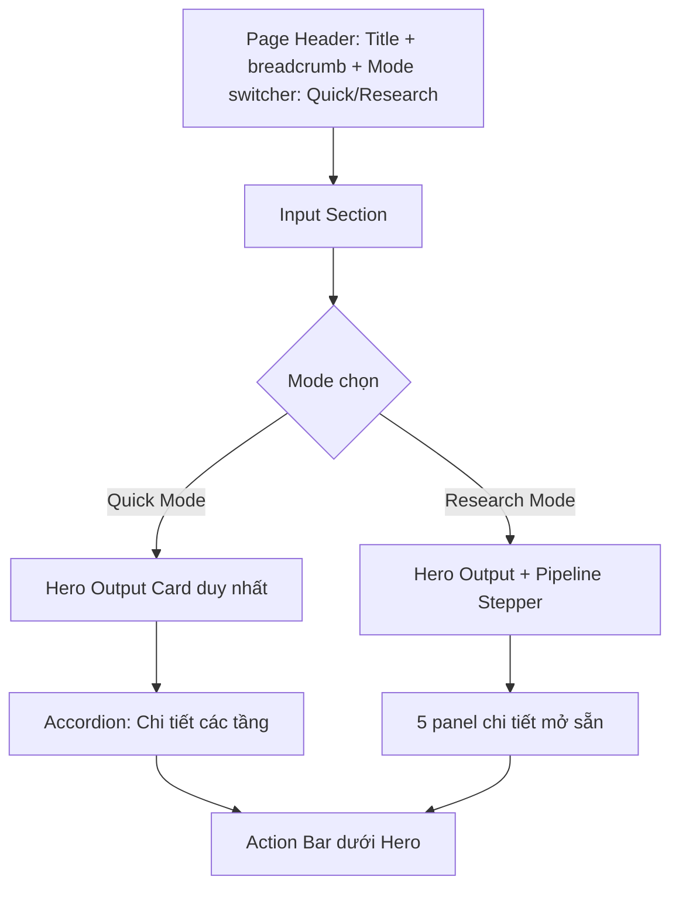

# Phân tích và đề xuất thiết kế lại — Trang Address Parser

> Phân tích các điểm vô lý của giao diện hiện tại và đề xuất thay đổi cho trang chính của VNAI Cloud (Single Address Parser).
>
> **Mốc:** 2026-05-17

---

## 1. Tóm tắt phát hiện

Giao diện hiện tại có **8 nhóm vấn đề** từ nghiêm trọng đến trung bình. Trong đó **2 vấn đề là showstopper** ảnh hưởng trực tiếp tới độ tin cậy của sản phẩm, **3 vấn đề logic** mâu thuẫn với pipeline HYBRID_V1 trong luận văn, và **3 vấn đề UX** làm người dùng khó ra quyết định.

| # | Vấn đề | Mức độ | Khu vực |
|---|--------|--------|---------|
| 1 | Retrieval đổi số nhà của địa chỉ (268 → 206, 268 → 174) | 🔴 Showstopper | Logic |
| 2 | Không có "kết quả cuối cùng" rõ ràng | 🔴 Showstopper | UX |
| 3 | NER (HF) và PreLabeler cùng trích thực thể nhưng kết quả khác nhau (1 vs 3) | 🟠 Logic | Logic |
| 4 | Epoch detect PRE_2025 mâu thuẫn với input có "Phường Diên Hồng" (POST_2025) | 🟠 Logic | Logic |
| 5 | PreLabeler được đặt ngang hàng với 4 model ML | 🟠 Logic | Kiến trúc |
| 6 | Trạng thái mâu thuẫn: "Đang xử lý" nhưng các card đều DONE | 🟡 UX | UX |
| 7 | Hai số latency không nhãn (1.330ms · 1250ms) | 🟡 UX | UX |
| 8 | Không có hành động sau khi có kết quả (Copy, Save, Use in code) | 🟡 UX | UX |

---

## 2. Phân tích chi tiết từng vấn đề

### 🔴 Vấn đề 1: Retrieval đổi số nhà — vi phạm hợp đồng dữ liệu

**Hiện trạng:**
- Input: `268 Lý Thường Kiệt, Phường Diên Hồng, Hồ Chí Minh, Việt Nam`
- PhoBERT Siamese trả về: `206 Lý Thường Kiệt, Phường Diên Hồng, ...` với **89.8% match**
- mGTE Siamese trả về: `174 Lý Thường Kiệt, Phường Diên Hồng, ...` với **91.8% match**

**Tại sao vô lý:**
- Số nhà (NUM) là **định danh duy nhất tại cấp đường** — không được sửa đổi bởi retrieval.
- Theo pipeline HYBRID_V1 trong luận văn, retrieval chỉ truy hồi **ứng viên đơn vị hành chính** (Phường/Quận/Tỉnh) từ corpus master, **không** retrieve số nhà.
- Display "Chuẩn hóa địa chỉ" với số nhà bị thay đổi là **gây hiểu nhầm nghiêm trọng** — khách hàng có thể đưa 206 vào hệ thống vận chuyển và giao sai địa chỉ.
- Match score 91.8% trong khi sản phẩm sai số nhà là dấu hiệu **calibration kém**.

**Đề xuất:**
1. Đổi tên section: từ "Chuẩn hóa địa chỉ bằng similarity retrieval" → **"Ứng viên gần nhất trong corpus master"**.
2. Ngắt số nhà ra khỏi kết quả retrieval — chỉ hiển thị "Phường Diên Hồng, Hồ Chí Minh" cho ứng viên, và **giữ nguyên số nhà từ input** trong chuỗi cuối cùng.
3. Tính match score chỉ trên phần admin (ward/district/province), không tính số nhà.
4. Hiển thị rõ: *"Số nhà giữ nguyên từ input — retrieval không sửa số nhà."*

### 🔴 Vấn đề 2: Không có "kết quả cuối cùng" rõ ràng

**Hiện trạng:**
- Người dùng thấy 5 cards với 5 kết quả khác nhau từ 5 model.
- Không card nào được đánh dấu là "kết quả khuyến nghị".
- ACS 79.8% và AUTO_CONVERT xuất hiện ở footer mơ hồ, không gắn với output cụ thể.

**Tại sao vô lý:**
- Pipeline HYBRID_V1 trong luận văn **luôn sinh ra một chuỗi `address_standardized` duy nhất** cuối cùng — đó mới là kết quả của hệ thống, không phải 5 kết quả song song.
- 5 model chỉ là **các tầng xử lý nội bộ** của pipeline, không phải 5 sản phẩm độc lập.
- Display kiểu "đa model" phù hợp với chế độ nghiên cứu (Research Mode), không phù hợp với người dùng SaaS bình thường muốn biết "địa chỉ đúng là gì".

**Đề xuất:**
1. **Hero output section** ở trên cùng, sau khi processing xong:

```
┌──────────────────────────────────────────────────────────────────┐
│ ✓ Đã chuẩn hóa                            ACS 0.79 • AUTO_CONVERT │
├──────────────────────────────────────────────────────────────────┤
│  📍 268 Lý Thường Kiệt, Phường Diên Hồng,                        │
│     TP. Hồ Chí Minh, Việt Nam                                     │
│                                                                    │
│  Tọa độ: 10.7713, 106.6589  •  Mã hành chính: 79-771-27262        │
│  Epoch: POST_2025 (hậu cải cách)                                  │
│                                                                    │
│  [📋 Sao chép JSON] [🗺 Xem trên bản đồ] [⚡ Code snippet] [🚩 Báo lỗi] │
└──────────────────────────────────────────────────────────────────┘
```

2. **Chi tiết các tầng pipeline** ẩn trong accordion bên dưới, chỉ mở khi user click "Xem chi tiết các tầng xử lý":

```
▼ Chi tiết các tầng xử lý (5 model)
  ├─ NER (HF / local) — DONE — 1.330ms
  ├─ PreLabeler (fallback) — DONE — 163ms
  ├─ Retrieval PhoBERT Siamese — DONE — 640ms
  ├─ Retrieval mGTE Siamese — DONE — 889ms
  └─ LLM Qwen 2.5 1.5B — DONE — 4.2s
```

### 🟠 Vấn đề 3: NER (HF) và PreLabeler trùng nhiệm vụ, kết quả khác nhau

**Hiện trạng:**
- NER (HF / local): "NUM: 268" — chỉ phát hiện **1 entity**.
- PreLabeler: "WDS: Phường Diên Hồng, STR: Lý Thường Kiệt, NUM: 268" — phát hiện **3 entities**.

**Tại sao vô lý:**
- Theo luận văn (Mục 4.5.1): *"PreLabeler là engine rule-based ... khi tải mô hình deep learning thất bại, endpoint phân tích địa chỉ có thể fallback sang PreLabeler."*
- Vậy PreLabeler là **fallback**, không phải tầng song song.
- Việc NER (HF) chỉ phát hiện 1/3 entities cho thấy hoặc (a) model NER yếu, hoặc (b) display sai (đang hiển thị 1 nhãn mà ẩn 2 nhãn khác).
- Hiển thị cả hai khiến người dùng không biết tin vào đâu — đây là **hệ quả của việc "đa hóa" không có chủ đích**.

**Đề xuất:**
1. **Hợp nhất** thành một card duy nhất "Trích xuất thực thể (NER)" — hiển thị kết quả tổng hợp.
2. Trong card NER, có tab "ML model (production)" vs "Rule-based (fallback)" để researcher có thể so sánh.
3. Khi ML model thành công, **chỉ hiển thị kết quả ML**. PreLabeler ẩn đi.
4. Khi ML fail, hiển thị banner: *"⚠️ Model ML không khả dụng — đang dùng PreLabeler rule-based làm fallback."*

### 🟠 Vấn đề 4: Epoch detect mâu thuẫn nội dung input

**Hiện trạng:**
- Input chứa "**Phường Diên Hồng**" — đây là một trong những **phường mới sau cải cách 01/07/2025** của TP.HCM (sáp nhập từ một số phường cũ).
- Epoch detect: `PRE_2025` (tiền cải cách).
- Quyết định ACS: `AUTO_CONVERT` (tự động chuyển đổi).

**Tại sao vô lý:**
- "Phường Diên Hồng" chỉ tồn tại sau 01/07/2025. Nếu input chứa tên này, epoch phải là `POST_2025`.
- AUTO_CONVERT (chuyển đổi từ pre sang post) là vô nghĩa khi input đã là post.
- Đây có thể là **bug của EpochDetector** hoặc lookup mapping bị nghịch.

**Đề xuất:**
1. Kiểm tra lại logic EpochDetector — chắc chắn nó nhận diện được các phường mới.
2. Hiển thị **lý do quyết định** trong tooltip: *"Epoch = POST_2025 vì 'Phường Diên Hồng' xuất hiện trong danh sách đơn vị hành chính hậu cải cách."*
3. Nếu AUTO_CONVERT không áp dụng được, cờ hiển thị `AUTO_ACCEPT` thay vì AUTO_CONVERT.

### 🟠 Vấn đề 5: PreLabeler đặt ngang hàng với model ML

**Hiện trạng:**
- 5 card hiển thị ngang hàng nhau: NER (HF), PreLabeler, PhoBERT Siamese, mGTE Siamese, Qwen LLM.

**Tại sao vô lý:**
- Theo kiến trúc HYBRID_V1, pipeline có cấu trúc tuần tự **NER → Retrieval → LLM → ACS**, không phải song song.
- 4 model ML là **các tầng xử lý** của một pipeline duy nhất, không phải 4 sản phẩm thay thế.
- Việc trình bày song song khiến user nghĩ "có thể chọn model tốt nhất" — không đúng với thiết kế.

**Đề xuất:**
1. Đổi từ "lưới card 5 model" sang **sơ đồ pipeline 4 bước** kiểu Stepper:

```
┌─────────┐    ┌────────────┐    ┌──────────┐    ┌──────────┐
│ 1. NER  │ ─→ │ 2. Retrieve│ ─→ │ 3. LLM   │ ─→ │ 4. ACS   │
│  DONE   │    │   DONE     │    │  DONE    │    │  DONE    │
│ 1.33s   │    │ 640+889ms  │    │  4.2s    │    │  3ms     │
└─────────┘    └────────────┘    └──────────┘    └──────────┘
   ▼              ▼                ▼                ▼
3 entities    Top-5 candidates   JSON output    Score 0.79
              (PhoBERT+mGTE)                    AUTO_CONVERT
```

2. Click vào mỗi bước hiển thị drawer chi tiết với output thô của tầng đó.

### 🟡 Vấn đề 6: Trạng thái xử lý mâu thuẫn

**Hiện trạng:**
- Button: "Đang xử lý" (active state).
- Banner: "Đang phân tích — 4/5 model hoàn thành...".
- 4 card đầu: trạng thái "DONE".
- Card thứ 5 (Qwen LLM): bị mờ/blur (vẫn đang chạy).

**Tại sao vô lý:**
- Trạng thái "Đang xử lý" trên button không phản ánh chính xác việc 4/5 đã xong.
- Banner "4/5 model hoàn thành" nói rõ là Qwen LLM đang chậm, nhưng button không cho phép user "Stop" hoặc "Bỏ qua LLM".

**Đề xuất:**
1. Button đổi sang **progress bar** với phần trăm: `[████████████████░░░░] 80% • Đang chạy Qwen LLM (~3s nữa)`.
2. Nút **"Bỏ qua LLM, dùng kết quả hiện có"** xuất hiện sau 5 giây nếu LLM chưa xong.
3. Card Qwen có skeleton loading rõ ràng thay vì blur effect.

### 🟡 Vấn đề 7: Hai số latency không nhãn

**Hiện trạng:**
- Cards hiển thị 2 số: `1.330ms · 1250ms`, `640ms · 437ms`, `889ms · 525ms`.
- Không có giải thích hai số này là gì.

**Tại sao vô lý:**
- Có thể là (a) cold-start vs warm latency, (b) request latency vs inference latency, (c) wall-clock vs CPU time — nhưng user không biết.
- Hai số không nhãn = **noise**, không có giá trị thông tin.

**Đề xuất:**
1. Chỉ hiển thị **một số canonical**: tổng wall-clock từ khi nhận request đến khi có output.
2. Hover tooltip để xem chi tiết: "1.330ms tổng = 80ms preprocessing + 1.170ms inference + 80ms postprocessing".
3. Thêm icon ⚡ cảnh báo khi latency vượt ngưỡng (>500ms cho NER, >2s cho LLM).

### 🟡 Vấn đề 8: Thiếu hành động sau khi có kết quả

**Hiện trạng:**
- Footer có buttons: "Nhãn NER", "Hàng loạt", "So sánh".

**Tại sao vô lý:**
- Những button này là **điều hướng tới tính năng khác**, không phải hành động trên kết quả vừa có.
- User vừa có một địa chỉ đã chuẩn hóa, họ muốn:
  - **Copy** vào clipboard (JSON hoặc text)
  - **Lưu** vào danh sách favorite hoặc gửi vào batch tiếp theo
  - **Code snippet** để paste vào ứng dụng của họ
  - **Báo cáo sai** nếu kết quả không đúng (đóng vòng feedback loop về PreLabeler cases)
  - **Xem map** với marker tại tọa độ trả về

**Đề xuất:**
1. Đưa các action result-specific vào **Hero output section** (như đã đề xuất ở mục 2).
2. Đưa các điều hướng (Hàng loạt, So sánh, Nhãn NER) lên top nav hoặc sidebar, không trộn lẫn với action trên kết quả.

---

## 3. Đề xuất thiết kế lại — Wireframe đầy đủ

### 3.1. Cấu trúc tổng thể



### 3.2. Wireframe ASCII — Quick Mode (Default cho SaaS user)

```
┌────────────────────────────────────────────────────────────────────┐
│ VNAI / Address Tools / Single Parser     [Quick] [Research]   ⚙   │
├────────────────────────────────────────────────────────────────────┤
│ Vietnamese Address Intelligence Parser                              │
│ Chuẩn hóa địa chỉ Việt Nam bằng pipeline AI HYBRID_V1               │
├────────────────────────────────────────────────────────────────────┤
│ 🟢 4/4 model AI sẵn sàng • 10.000 địa chỉ trong corpus              │
│                                          [NER✓ Retr✓ LLM✓] [⟳]      │
├────────────────────────────────────────────────────────────────────┤
│ ┌──────────────────────────────────────────────────────────────┐  │
│ │ 📍 268 Lý Thường Kiệt, Phường Diên Hồng, Hồ Chí Minh, VN     │  │
│ └──────────────────────────────────────────────────────────────┘  │
│                              [Phân tích →]  [↻ Ví dụ] [📥 Hàng loạt]│
├────────────────────────────────────────────────────────────────────┤
│ ╔══════════════════════════════════════════════════════════════╗  │
│ ║ ✓ Đã chuẩn hóa thành công           ACS 0.79 • AUTO_CONVERT  ║  │
│ ╠══════════════════════════════════════════════════════════════╣  │
│ ║                                                                ║  │
│ ║  268 Lý Thường Kiệt, Phường Diên Hồng,                        ║  │
│ ║  TP. Hồ Chí Minh, Việt Nam                                     ║  │
│ ║                                                                ║  │
│ ║  ┌───────────────────────────────┬─────────────────────────┐ ║  │
│ ║  │ Thành phần                    │ Mã hành chính           │ ║  │
│ ║  ├───────────────────────────────┼─────────────────────────┤ ║  │
│ ║  │ Số nhà:    268                │                          │ ║  │
│ ║  │ Đường:     Lý Thường Kiệt     │                          │ ║  │
│ ║  │ Phường:    Phường Diên Hồng   │ 27262                    │ ║  │
│ ║  │ Quận:      (đã hợp nhất 2025) │ —                        │ ║  │
│ ║  │ Tỉnh/TP:   TP. Hồ Chí Minh    │ 79                       │ ║  │
│ ║  └───────────────────────────────┴─────────────────────────┘ ║  │
│ ║                                                                ║  │
│ ║  Tọa độ: 10.7713°N, 106.6589°E                                ║  │
│ ║  Epoch:  POST_2025 (hậu cải cách hành chính 01/07/2025)       ║  │
│ ║                                                                ║  │
│ ║  ┌─────────────┐                                              ║  │
│ ║  │ 🗺  Mini-map │ (Click để mở map fullscreen)                 ║  │
│ ║  │   marker    │                                              ║  │
│ ║  └─────────────┘                                              ║  │
│ ║                                                                ║  │
│ ║  [📋 Sao chép JSON] [🗺 Bản đồ] [⚡ Code]  [🚩 Báo lỗi] [⭐ Lưu] ║  │
│ ╚══════════════════════════════════════════════════════════════╝  │
│                                                                     │
│  ▼ Xem chi tiết 4 tầng xử lý của pipeline                          │
│    (NER → Retrieval → LLM → ACS — tổng 6.8s)                       │
└────────────────────────────────────────────────────────────────────┘
```

### 3.3. Wireframe ASCII — Research Mode (mở rộng chi tiết)

```
┌────────────────────────────────────────────────────────────────────┐
│ ╔══════════════════════════════════════════════════════════════╗  │
│ ║ Hero output (như Quick Mode)                                  ║  │
│ ╚══════════════════════════════════════════════════════════════╝  │
│                                                                     │
│ 🔬 Pipeline HYBRID_V1 — 8 bước                                     │
│ ┌────────────────────────────────────────────────────────────────┐│
│ │  ●──────●──────●──────●──────●──────●──────●──────●           ││
│ │  NER   Norm   Ctx    Retr   LLM    Epoch  ACS    Save         ││
│ │  ✓     ✓      ✓      ✓      ✓      ✓     ✓      ✓             ││
│ │ 1.3s  10ms    5ms   640ms  4.2s    8ms   3ms    20ms          ││
│ └────────────────────────────────────────────────────────────────┘│
│                                                                     │
│ Tab: [NER] [Retrieval] [LLM] [ACS]                                  │
│ ┌────────────────────────────────────────────────────────────────┐│
│ │ Tab "Retrieval" được chọn:                                     ││
│ │                                                                  ││
│ │ Top-5 ứng viên đơn vị hành chính (KHÔNG bao gồm số nhà):        ││
│ │ ┌──────────────────────────────────────────────────────────┐   ││
│ │ │ # │ Ứng viên                          │ PhoBERT │ mGTE   │   ││
│ │ ├──────────────────────────────────────────────────────────┤   ││
│ │ │ 1 │ Phường Diên Hồng, TP.HCM           │ 91.8%   │ 93.2% │   ││
│ │ │ 2 │ Phường Bến Thành, TP.HCM           │ 78.4%   │ 75.1% │   ││
│ │ │ 3 │ Phường Cầu Ông Lãnh, TP.HCM        │ 71.2%   │ 69.8% │   ││
│ │ │ 4 │ Phường Nguyễn Thái Bình, TP.HCM    │ 68.5%   │ 65.3% │   ││
│ │ │ 5 │ Phường Phạm Ngũ Lão, TP.HCM        │ 65.1%   │ 62.7% │   ││
│ │ └──────────────────────────────────────────────────────────┘   ││
│ │                                                                  ││
│ │ ℹ️ Số nhà 268 được giữ nguyên từ input — retrieval chỉ trả về   ││
│ │   ứng viên cấp Phường/Quận/Tỉnh.                                ││
│ └────────────────────────────────────────────────────────────────┘│
└────────────────────────────────────────────────────────────────────┘
```

### 3.4. Cấu trúc dữ liệu output (cho Copy JSON)

```json
{
  "input": "268 Lý Thường Kiệt, Phường Diên Hồng, Hồ Chí Minh, Việt Nam",
  "standardized": {
    "full_address": "268 Lý Thường Kiệt, Phường Diên Hồng, TP. Hồ Chí Minh, Việt Nam",
    "components": {
      "house_number": "268",
      "street": "Lý Thường Kiệt",
      "ward": { "name": "Phường Diên Hồng", "id": "27262" },
      "district": null,
      "province": { "name": "TP. Hồ Chí Minh", "id": "79" }
    },
    "coordinates": { "lat": 10.7713, "lng": 106.6589 },
    "epoch": "POST_2025"
  },
  "confidence": {
    "acs_score": 0.79,
    "acs_decision": "AUTO_CONVERT",
    "components": {
      "S_text": 0.85,
      "S_sem": 0.92,
      "V_hier": 1.0,
      "V_temporal": 1.0
    }
  },
  "pipeline": {
    "version": "HYBRID_V1",
    "total_latency_ms": 6810,
    "models_used": ["AddressNER", "SiameseMGTE", "Qwen2.5-1.5B-Instruct"]
  }
}
```

---

## 4. Bảng đối chiếu trước/sau

| Yếu tố | Trước (hiện tại) | Sau (đề xuất) |
|--------|------------------|---------------|
| Số card kết quả | 5 song song | 1 hero + accordion chi tiết |
| Số nhà trong retrieval | Bị thay đổi (268→206) | Giữ nguyên, retrieval chỉ ứng viên cấp ward |
| Kết quả khuyến nghị | Không có (user tự quyết) | Hero card duy nhất ở top |
| Trạng thái xử lý | Mâu thuẫn (button vs banner) | Progress bar nhất quán |
| PreLabeler | Ngang hàng ML | Fallback chỉ hiện khi ML fail |
| Latency display | 2 số không nhãn | 1 số canonical + tooltip |
| Hành động trên kết quả | Không có | 5 action: Copy/Map/Code/Báo lỗi/Lưu |
| Map preview | Không có | Mini-map trong hero |
| Mode | Một chế độ duy nhất | Quick (default) + Research |
| Pipeline visualization | Không có | Stepper 8 bước trong Research mode |

---

## 5. Tóm tắt ưu tiên triển khai

| Ưu tiên | Tính năng | Lý do | Effort |
|---------|-----------|-------|--------|
| **P0** | Sửa retrieval không đổi số nhà | Showstopper về data integrity | Low (logic fix) |
| **P0** | Hero output card với địa chỉ chuẩn hóa cuối cùng | Showstopper về UX | Medium |
| **P0** | Sửa EpochDetector bug "Diên Hồng" → POST_2025 | Sai logic nghiệp vụ | Low |
| **P1** | Hợp nhất NER (HF) + PreLabeler thành 1 card | Loại bỏ confusion | Medium |
| **P1** | Pipeline stepper 4 bước cho Research mode | Phản ánh đúng HYBRID_V1 | Medium |
| **P1** | Action bar (Copy/Map/Code/Báo lỗi/Lưu) | UX cơ bản | Low |
| **P2** | Mini-map preview | Tăng giá trị visual | Medium |
| **P2** | Progress bar thay button "Đang xử lý" | Trạng thái nhất quán | Low |
| **P3** | Hover tooltip latency breakdown | Nice-to-have | Low |
| **P3** | Mode switcher Quick/Research | Phục vụ 2 personas | Medium |

---

## 6. Kết luận

Vấn đề lớn nhất của giao diện hiện tại là **"hiển thị quá trình thay vì hiển thị kết quả"** — phù hợp để debug pipeline nhưng không phù hợp cho người dùng SaaS bình thường. Hai vấn đề showstopper (retrieval đổi số nhà + thiếu kết quả cuối cùng) cần khắc phục trước khi đưa sản phẩm ra thị trường.

Đề xuất tách hai chế độ rõ ràng: **Quick Mode** cho 95% người dùng (Hero output + actions), và **Research Mode** cho data scientist/researcher (Pipeline stepper + chi tiết từng tầng). Điều này phù hợp với hai personas đã định nghĩa trong tài liệu SaaS Feature Specification (Developer/Vận hành vs Nhà nghiên cứu/Annotator).
