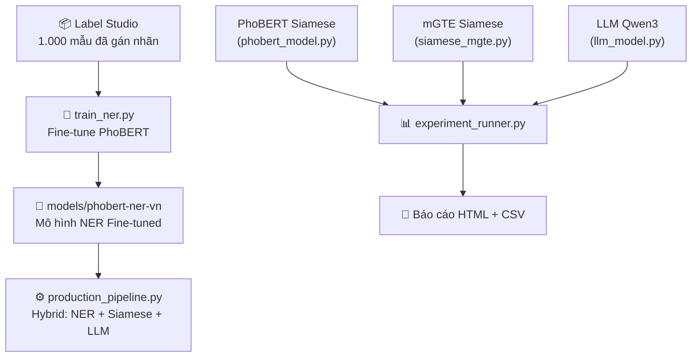

# Kế hoạch Chi tiết: Giai đoạn Huấn luyện Mô hình

> **Giai đoạn:** 28/04 – 04/05/2026 (7 ngày)  
> **Điều kiện tiên quyết:** Hoàn tất gán nhãn 1.000 mẫu trên Label Studio  
> **Đầu ra mong muốn:** Mô hình PhoBERT NER fine-tuned + Kết quả so sánh 3 mô hình

---

## Tổng quan Kiến trúc Hệ thống AI



---

## Phân tích Gap: Code Hiện tại vs. Code Cần Hoàn thiện

> [!IMPORTANT]
> Phân tích dưới đây cho thấy các phần code **đã có khung** nhưng **chưa hoạt động được**. Đây là danh sách công việc chính.

| File | Trạng thái | Gap cần xử lý |
|---|---|---|
| [train_ner.py](file:///d:/2.GIT%20SOURCE/vn-address-intelligence/app/ai/train_ner.py) | ⚠️ Khung sẵn, chưa chạy được | Thiếu logic chuyển đổi Label Studio JSON → BIO tokens. Trainer đang bị comment out. |
| [ner_model.py](file:///d:/2.GIT%20SOURCE/vn-address-intelligence/app/ai/models/ner_model.py) | ⚠️ Hoạt động với Regex fallback | Cần test lại sau khi có model fine-tuned tại `models/phobert-ner-vn/` |
| [experiment_runner.py](file:///d:/2.GIT%20SOURCE/vn-address-intelligence/app/ai/experiment_runner.py) | ⚠️ Khung sẵn | Cần cập nhật `config.yaml` để trỏ đúng bảng `prq.address_cleansing_queue` |
| [config.yaml](file:///d:/2.GIT%20SOURCE/vn-address-intelligence/app/ai/config.yaml) | ⚠️ Cấu hình cũ | Đang trỏ `schema: scm`, `table_name: address` — cần đổi sang `prq` / `address_cleansing_queue` |
| [metrics.py](file:///d:/2.GIT%20SOURCE/vn-address-intelligence/app/ai/metrics.py) | ✅ Hoàn chỉnh | Đã có Exact Match, Fuzzy Match, Component Accuracy, Latency |
| [report_generator.py](file:///d:/2.GIT%20SOURCE/vn-address-intelligence/app/ai/report_generator.py) | ✅ Hoàn chỉnh | Đã có HTML report + CSV export |
| [production_pipeline.py](file:///d:/2.GIT%20SOURCE/vn-address-intelligence/app/ai/production_pipeline.py) | ⚠️ Khung sẵn | Cần test end-to-end sau khi NER model hoàn tất |
| [constants.py](file:///d:/2.GIT%20SOURCE/vn-address-intelligence/app/ai/constants.py) | ✅ Hoàn chỉnh | 10 nhãn NER đồng bộ toàn hệ thống |

---

## Lịch trình Chi tiết theo Ngày

### Ngày 1 (28/04) — Chuyển đổi Dữ liệu Label Studio → Training Format

**Mục tiêu:** Viết hoàn chỉnh hàm `convert_labelstudio_to_bio()` trong `train_ner.py`

**Công việc cụ thể:**

1. **Export dữ liệu từ Label Studio** → File JSON (ví dụ: `data/labeled_export_1000.json`)
2. **Viết hàm chuyển đổi** trong `train_ner.py`:
   - Đọc file JSON export từ Label Studio
   - Tokenize text bằng PhoBERT tokenizer (`vinai/phobert-base`)
   - Align các span nhãn (start, end) với sub-tokens của PhoBERT
   - Gán nhãn BIO cho từng token: `B-NUM`, `I-NUM`, `B-STR`, `I-STR`, ..., `O`
   - Xử lý edge case: token bị chia nhỏ (sub-word), nhãn chồng lấn

3. **Chia dữ liệu Train/Eval**: 80% train (800 mẫu), 20% eval (200 mẫu)
4. **Validate**: In ra 10 mẫu đầu tiên để kiểm tra nhãn BIO có đúng không

```python
# Pseudo-code cho hàm chuyển đổi
def convert_labelstudio_to_bio(json_path, tokenizer, label2id):
    """
    Input: File JSON export từ Label Studio
    Output: HuggingFace Dataset với columns: [input_ids, attention_mask, labels]
    """
    for item in data:
        text = item["data"]["text"]
        annotations = item["annotations"][0]["result"]  # Lấy annotation đầu tiên
        
        # 1. Tokenize text
        encoding = tokenizer(text, return_offsets_mapping=True, ...)
        
        # 2. Map spans → token-level BIO labels
        labels = ["O"] * len(encoding.input_ids)
        for ann in annotations:
            start, end = ann["value"]["start"], ann["value"]["end"]
            label = ann["value"]["labels"][0]  # VD: "NUM"
            # Tìm tokens nằm trong [start, end] và gán B-/I-
            ...
        
        # 3. Convert labels → ids
        label_ids = [label2id.get(l, label2id["O"]) for l in labels]
```

> [!WARNING]
> PhoBERT sử dụng BPE tokenizer — một từ tiếng Việt có thể bị chia thành nhiều sub-tokens. Cần xử lý cẩn thận việc align nhãn: chỉ token đầu tiên của một từ mới được gán nhãn `B-`, các sub-tokens còn lại gán `-100` (ignored by loss function).

---

### Ngày 2 (29/04) — Fine-tune PhoBERT NER

**Mục tiêu:** Chạy training thành công, đạt F1 > 0.70 trên eval set

**Công việc cụ thể:**

1. **Cấu hình Training Arguments**:
   ```python
   TrainingArguments(
       output_dir="models/phobert-ner-vn",
       evaluation_strategy="epoch",
       learning_rate=2e-5,        # Learning rate chuẩn cho BERT fine-tuning
       per_device_train_batch_size=16,  # Tùy VRAM GPU
       num_train_epochs=15,       # 1.000 mẫu cần nhiều epoch hơn
       weight_decay=0.01,
       warmup_ratio=0.1,          # Warm-up 10% steps đầu
       save_total_limit=3,
       load_best_model_at_end=True,
       metric_for_best_model="f1",
   )
   ```

2. **Thêm hàm compute_metrics cho Trainer**:
   - Tính Precision, Recall, F1 cho từng nhãn (PCD, NUM, STR, ALY, BLD, POI, NHB, WDS, DST, PRO)
   - Sử dụng thư viện `seqeval` (chuẩn công nghiệp cho NER evaluation)
   - Cài đặt: `pip install seqeval`

3. **Chạy training**:
   ```bash
   python app/ai/train_ner.py --data data/labeled_export_1000.json
   ```

4. **Kiểm tra kết quả**: Xem loss giảm dần qua các epoch, F1 trên eval set

> [!TIP]
> Nếu không có GPU mạnh trên máy local, cân nhắc sử dụng **Google Colab** (T4 GPU miễn phí). File [colab_guide.md](file:///d:/2.GIT%20SOURCE/vn-address-intelligence/docs/colab_guide.md) đã có hướng dẫn sẵn.

---

### Ngày 3 (30/04) — Đánh giá NER + Tối ưu

**Mục tiêu:** Phân tích lỗi, tối ưu hyperparameters, đạt F1 ≥ 0.80

**Công việc cụ thể:**

1. **Phân tích lỗi (Error Analysis)**:
   - In ra các mẫu bị dự đoán sai trên eval set
   - Phân loại lỗi: Nhãn nào hay bị nhầm? (VD: NUM vs STR, WDS vs DST)
   - Ghi nhận các pattern lỗi phổ biến

2. **Tối ưu Hyperparameters** (nếu F1 < 0.80):
   - Thử `learning_rate`: 1e-5, 2e-5, 3e-5, 5e-5
   - Thử `num_train_epochs`: 10, 15, 20, 30
   - Thử `batch_size`: 8, 16, 32
   - Thử `max_seq_length`: 128, 256

3. **Bổ sung dữ liệu** (nếu cần):
   - Kết hợp 1.000 mẫu gán nhãn thủ công + 25.130 mẫu synthetic từ `ath.training_datasets`
   - Chú ý: Dữ liệu synthetic cần được chuyển sang format BIO tương tự

4. **Lưu model tốt nhất**: `models/phobert-ner-vn/`

---

### Ngày 4 (01/05) — Cập nhật Config + Chuẩn bị Experiment

**Mục tiêu:** Cấu hình đúng để chạy `experiment_runner.py`

**Công việc cụ thể:**

1. **Cập nhật `config.yaml`**:

```diff
 database:
-  schema: "scm"
-  table_name: "address"
+  schema: "prq"
+  table_name: "address_cleansing_queue"
   id_column: "id"
-  input_column: "street_address"
+  input_column: "raw_address"
   ground_truth_column: ""
-  limit: 200
+  limit: 1000
 
 experiment:
-  standard_addresses_schema: "scm"
-  standard_addresses_table: "address"
-  standard_addresses_column: "street_address"
-  corpus_limit: 200
+  standard_addresses_schema: "prq"
+  standard_addresses_table: "address_cleansing_queue"
+  standard_addresses_column: "raw_address"
+  corpus_limit: 5000
```

2. **Tạo Ground Truth** cho 1.000 mẫu đánh giá:
   - Query 1.000 địa chỉ ngẫu nhiên từ `prq.address_cleansing_queue`
   - Gọi Google Maps Geocoding API để lấy địa chỉ chuẩn
   - Lưu vào cột `address_standardized` (làm ground truth)
   - Script: Tạo `scripts/create_ground_truth.py`

3. **Kiểm tra `experiment_runner.py`**:
   - Sửa dòng `from db_connector import DBConnector` → đảm bảo import path đúng
   - Sửa config path mặc định: `--config app/ai/config.yaml`

---

### Ngày 5 (02/05) — Chạy Thực nghiệm So sánh 3 Mô hình

**Mục tiêu:** Chạy thành công PhoBERT Siamese + mGTE Siamese + LLM Qwen3

**Công việc cụ thể:**

1. **Chạy từng mô hình riêng biệt** để debug:
   ```bash
   # Chạy PhoBERT Siamese (nhanh nhất)
   python app/ai/experiment_runner.py --config app/ai/config.yaml --no-llm
   
   # Chạy đầy đủ 3 mô hình (bao gồm LLM — chậm hơn)
   python app/ai/experiment_runner.py --config app/ai/config.yaml
   ```

2. **Kiểm tra kết quả**:
   - Mở `reports/experiment_report.html` trên trình duyệt
   - Xem bảng so sánh: Exact Match, Fuzzy Match, Component Accuracy
   - Xem Winner Box: Mô hình nào đạt Composite Score cao nhất?

3. **Lưu ý về Corpus**:
   - PhoBERT Siamese và mGTE Siamese hoạt động theo cơ chế **Bi-Encoder**: encode corpus một lần, rồi tìm địa chỉ gần nhất bằng cosine similarity
   - Corpus nên là tập hợp các địa chỉ chuẩn (unique, đầy đủ cấp hành chính)
   - Cân nhắc tạo corpus từ việc ghép: `street_address + ward_name + district_name + province_name`

---

### Ngày 6 (03/05) — Tích hợp NER vào Production Pipeline + Bổ sung NER Metrics

**Mục tiêu:** Hoàn thiện luồng Hybrid end-to-end

**Công việc cụ thể:**

1. **Test NER model trong production_pipeline.py**:
   ```bash
   python app/ai/production_pipeline.py --config app/ai/config.yaml --limit 10
   ```
   - Kiểm tra NER có bóc tách đúng NUM, STR, ALY, BLD... không
   - Kiểm tra LLM có nhận được context đúng không
   - Kiểm tra kết quả có được lưu vào DB không

2. **Bổ sung NER-specific metrics vào `metrics.py`**:
   - Thêm Entity-level F1 Score (Precision, Recall cho từng nhãn)
   - Thêm Token-level Accuracy
   - Tính trên tập eval 200 mẫu đã gán nhãn

3. **Chạy batch lớn hơn**: 
   ```bash
   python app/ai/production_pipeline.py --config app/ai/config.yaml --limit 1000
   ```

---

### Ngày 7 (04/05) — Tổng hợp + Viết Kết quả

**Mục tiêu:** Hoàn tất toàn bộ thực nghiệm, sẵn sàng cho chương Thực nghiệm của luận văn

**Công việc cụ thể:**

1. **Chạy experiment cuối cùng** trên quy mô lớn (5.000 - 10.000 mẫu)
2. **Xuất báo cáo chính thức**:
   - `reports/experiment_report.html` — Bảng so sánh visual
   - `reports/experiment_results.csv` — Dữ liệu thô
   - Screenshot cho luận văn

3. **Tổng hợp số liệu cho báo cáo GVHD**:

| Chỉ số | PhoBERT Siamese | mGTE Siamese | LLM (Qwen3) | Kỳ vọng |
|---|---|---|---|---|
| Exact Match | ? | ? | ? | ≥ 30% |
| Fuzzy Match (≥0.85) | ? | ? | ? | ≥ 60% |
| Phường Accuracy | ? | ? | ? | ≥ 80% |
| Quận Accuracy | ? | ? | ? | ≥ 85% |
| Tỉnh Accuracy | ? | ? | ? | ≥ 90% |
| NER F1-Score | ? | N/A | N/A | ≥ 82% |
| Throughput (qps) | ? | ? | ? | ≥ 20 |

4. **Commit + Push**: Tag version `v1.0-experiment`

---

## Danh sách Dependencies cần cài đặt

```bash
# Core Training
pip install torch transformers datasets seqeval accelerate

# Sentence Transformers (cho Siamese models)
pip install sentence-transformers

# Vietnamese NLP
pip install pyvi  # Tách từ tiếng Việt cho PhoBERT

# Evaluation
pip install scikit-learn numpy pandas

# Report
pip install tabulate
```

---

## Rủi ro và Phương án Dự phòng

| Rủi ro | Xác suất | Phương án |
|---|---|---|
| F1-Score NER quá thấp (< 0.70) | Trung bình | Bổ sung 25.130 mẫu synthetic từ `ath.training_datasets`. Tăng epoch lên 30. |
| Không có GPU đủ mạnh | Cao | Sử dụng Google Colab Pro (T4/A100). File `colab_guide.md` đã sẵn. |
| LLM Qwen3 chạy quá chậm | Cao | Bật `use_quantization: true` trong config. Hoặc dùng `--no-llm` để bỏ qua. |
| Dữ liệu gán nhãn chưa đủ chất lượng | Thấp | Chạy thêm export 2.000 mẫu với Hybrid PreLabeler cải tiến, gán nhãn bổ sung. |
| Google Maps API quota hết | Thấp | Giới hạn ground truth ở 1.000 mẫu. Sử dụng free tier ($200/tháng). |

---

## Checklist Tổng hợp

- [ ] Export dữ liệu đã gán nhãn từ Label Studio (JSON)
- [ ] Hoàn thiện `convert_labelstudio_to_bio()` trong `train_ner.py`
- [ ] Fine-tune PhoBERT NER thành công (F1 ≥ 0.80)
- [ ] Lưu model tại `models/phobert-ner-vn/`
- [ ] Cập nhật `config.yaml` cho đúng bảng `prq`
- [ ] Tạo Ground Truth 1.000 mẫu (Google Maps API)
- [ ] Chạy `experiment_runner.py` so sánh 3 mô hình
- [ ] Xuất báo cáo HTML + CSV
- [ ] Test `production_pipeline.py` end-to-end
- [ ] Commit + Tag version
