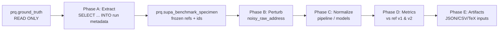

# Protocol: Synthetic User-Style Perturbation Benchmark on Google-Derived Reference Addresses (Read-Only `prq.ground_truth`)

**Document type:** Reproducible experimental protocol + dataset specification (Materials & Methods / Supplementary Protocol).  
**Version:** 1.0  
**Scope:** Thiết kế luồng **trích xuất chỉ đọc** từ `prq.ground_truth`, tạo **tập thí nghiệm tách biệt** (bảng mới), **làm nhiễu có kiểm soát**, chạy chuẩn hóa, **đo đạc đầy đủ** phục vụ các chương phương pháp và kết quả (ánh xạ **Chương 4–6** theo cấu trúc luận điển hình).

---

## 0. Đóng góp khoa học được làm rõ bởi protocol này

1. **Gold có nguồn gốc rõ** (Google-collected, đã chuẩn hóa trong `prq.ground_truth`), với **hai mặt tham chiếu** theo phiên bản hành chính: `address` (admin v2) và `old_address` (admin v1).  
2. **Đầu vào bị hỏng có kiểm soát** (synthetic user-style perturbation) — **tách biệt** khỏi dữ liệu hàng chờ sản xuất, tránh làm ô nhiễm ước lượng hiện trường.  
3. **Tái lập được** (seed, phiên bản profile nhiễu, cỡ mẫu \(N\), snapshot DB, commit mã).  
4. **Đo lường song tham chiếu** giải thích được hiện tượng “đúng theo v1 nhưng lệch v2” và ngược lại — có giá trị phương pháp luận trong bối cảnh đổi ranh giới hành chính Việt Nam.

---

## 1. Quy tắc bất biến (Immutability Contract)

| Quy tắc | Nội dung |
|--------|-----------|
| **R0 — Không ghi `prq.ground_truth`** | **Cấm** mọi thao tác `INSERT` / `UPDATE` / `DELETE` / `TRUNCATE` trên `prq.ground_truth` trong toàn bộ luồng thí nghiệm. Chỉ **`SELECT`** (trích xuất). |
| **R1 — Tách vật lý** | Mọi bản ghi phục vụ benchmark được lưu ở **bảng mới** (hoặc schema staging), có tiền tố/tên vực trỏ rõ mục đích *evaluation*. |
| **R2 — Khả truy xuất nguồn** | Mỗi mẫu thí nghiệm lưu **`ground_truth_id`** (hoặc tương đương) copy từ khóa chính bảng gốc **chỉ để join ngược khi đọc**, không tạo FK bắt buộc ghi ngược lên gold nếu gây hiểu nhầm vận hành; khuyến nghị **lưu snapshot văn bản** `ref_address_v2`, `ref_address_v1` tại thời điểm trích để báo cáo **đóng băng** (frozen reference). |
| **R3 — Phiên bản hóa nhiễu** | Mọi lần sinh nhiễu gắn **`noise_profile_id`** (semantic version, ví dụ `SUP-1.0.0`) + **`rng_seed`**. |

Vi phạm R0 **loại khỏi** tính hợp lệ của báo cáo khoa học nội bộ.

---

## 2.1. Chuỗi chứng cứ (provenance) — từng bước phải ghi trong luận / phụ lục

Để số **EM\@v2 / EM\@v1** trong báo cáo là *chắc chắn* (tái kiểm được), mỗi lần benchmark phải có **chuỗi artifact** tối thiểu sau:

| Bước | Hành động | Artifact bắt buộc | Điều kiện để ghi vào luận |
|------|-----------|-------------------|---------------------------|
| **S0** | Áp DDL `prq.supa_benchmark_*` | Log migration / ticket DBA | Có bảng trên đúng DB snapshot |
| **S1** | `supa_benchmark.py extract` | `reports/supa_benchmark_last_run_id.txt` + dòng `supa_benchmark_run` | Ghi `run_id`, `N`, `seed`, `noise_profile_id`, `git_commit` |
| **S2** | `export-specimens` | CSV (cột `noisy_raw_address`, `specimen_id`, …) | File path + thời điểm xuất |
| **S3** | Chuẩn hóa **do bạn khai báo** (pipeline nội bộ, API, hoặc script khác) | Log / config / checkpoint / commit **cùng** với mô tả trong Mục phương pháp | **Không** suy diễn: phải nêu rõ “đầu ra chuẩn hóa lấy từ đâu” |
| **S4** | `import-preds --source-note "..."` | `reports/supa_benchmark_last_import_manifest.json` | `source-note` phải đủ để độc giả tái lập (vd. `config.yaml`, artifact model, commit) |
| **S5** | `eval` | `reports/supa_benchmark_last_metrics.json` | Chỉ khi `n_scored > 0` mới có EM khác `null` |
| **S6** | `export-tex` | `vnai-supa-generated-metrics.tex` | Macro LaTeX khớp JSON |

**S0 trên máy không có `psql` (điển hình Windows):** `python scripts/sql/apply_sql_file.py scripts/migration/20260209_prq_supa_benchmark_tables.sql` — đọc `DB_*` từ `.env` như ứng dụng.

**Điểm then chốt:** Cột `pred_standardized` là **đầu ra đã khai báo nguồn gốc** (S3–S4). Không có S3–S4 thì `eval` vẫn chạy nhưng **EM không được báo cáo** (hoặc chỉ báo “chưa chấm”).

---

## 2.2. Có cần lệnh con `normalize` gọi thẳng `production_pipeline` không?

**Không bắt buộc** cho tính hợp lệ khoa học. **Không tích hợp sẵn** trong repo vì:

1. **`production_pipeline` gắn với `prq.address_cleansing_queue`** (cột trạng thái, batch, corpus load, LLM…) — khác schema với `supa_benchmark_specimen`. “Gọi thẳng” đồng nghĩa adapter + rủi ro ghi nhầm hàng chờ sản xuất nếu cấu hình sai.
2. **Báo cáo khoa học cần tách** “tập đánh giá” khỏi “dữ liệu vận hành”; chuỗi **export CSV → chạy normalizer đã mô tả → import CSV** làm **nguồn gốc dự đoán** minh bạch hơn một nút “normalize ẩn”.
3. Nếu sau này thêm `normalize` tích hợp, nó phải: chỉ đọc `noisy_raw_address`, chỉ ghi `pred_standardized`, **không** đụng queue, và **tự động ghi manifest** (config path, model path, commit) — tương đương `import-preds` về mặt chứng cứ.

**Khuyến nghị hiện tại:** dùng **`export-specimens` + `import-preds`**; trong luận trích dẫn `source-note` và file manifest.

---

## 2.3. Đặt tên khoa học (English naming — dùng trong luận & SQL)

**Tên gọi bộ benchmark (paper-friendly):**

> **SUPA-Bench** — *Synthetic User-style Perturbation of Address strings, benchmarked against dual Google-derived references (admin v1/v2).*

**Tên thực thể trong CSDL (gợi ý — snake_case, PostgreSQL):**

| Thực thể | Tên bảng gợi ý | Vai trò |
|----------|------------------|--------|
| **Lần chạy thí nghiệm** | `prq.supa_benchmark_run` | Metadata: `run_id`, `created_at`, `n_requested`, `n_realized`, `rng_seed`, `noise_profile_id`, `source_table` (= `'prq.ground_truth'`), `git_commit`, `db_snapshot_note`. |
| **Mẫu (specimen)** | `prq.supa_benchmark_specimen` | Một dòng = một địa chỉ sau trích + nhiễu + (sau pipeline) kết quả. Khóa: `specimen_id` hoặc `(run_id, local_idx)`. |
| **Tham chiếu đóng băng** | Cột trên specimen | `ground_truth_id`, `ref_address_v2` (= copy `address` lúc trích), `ref_address_v1` (= copy `old_address`). |
| **Đầu vào nhiễu** | `noisy_raw_address` | Chuỗi đưa vào pipeline chuẩn hóa. |
| **Đầu ra mô hình** | Cột tùy pipeline | Ví dụ `pred_standardized`, hoặc mirror các cột như trên queue (`address_standardized`, …) **chỉ trên bảng specimen**. |

*Tùy chọn tên ngắn hơn nếu muốn tránh acronym:* `prq.eval_synthetic_noisy_address_run` / `prq.eval_synthetic_noisy_address_row` — vẫn chấp nhận được miễn **đồng nhất** trong luận và repo.

---

## 3. Luồng tổng thể (end-to-end)

---

## 4. Phase A — Trích xuất (linh động \(N\))

**Đầu vào tham số hóa:** `N ∈ {10000, 50000, …}`, `rng_seed`, tùy chọn **stratification** (theo `province_id`, độ dài chuỗi, v.v.).

**Điều kiện lọc tối thiểu (gợi ý phương pháp):**

- `address IS NOT NULL` AND `trim(address) <> ''`  
- `old_address IS NOT NULL` AND `trim(old_address) <> ''` *(nếu mục tiêu song tham chiếu)*  
- Loại bản ghi trùng lặp nghiêm trọng (hash chuỗi) nếu cần — **ghi rõ** trong luận.

**Thao tác:** chỉ `SELECT` từ `prq.ground_truth` → `INSERT` vào `prq.supa_benchmark_specimen` (bảng mới). **Không** ghi ngược GT.

**Kết quả mong đợi:** `n_realized = N` (hoặc báo cáo lệch nếu sau lọc không đủ — *protocol phải ghi nhận*).  
**Artifact:** một dòng trong `prq.supa_benchmark_run` + thống kê mô tả (độ dài, tỉ lệ có số nhà, …) cho **Chương 5**.

---

## 5. Phase B — Làm nhiễu (deterministic, có phiên bản)

**Nguyên tắc:** mỗi profile nhiễu là **hàm**  
\(\; f(\text{ref\_text}, \text{seed}, \text{specimen\_idx}) \rightarrow \text{noisy\_raw\_address}\;\)  
để **cùng commit mã + cùng seed** cho cùng tập `ground_truth_id` thì tái lập được.

**Lớp nhiễu (ví dụ phân tầng — báo trong Chương 4):**

| Mã lớp | Hiện tượng người dùng | Ghi chú phương pháp |
|--------|------------------------|---------------------|
| L1 | Tiền tố / hậu tố (“gần”, “đối diện”, “nhà số…”) | Báo tỉ lệ áp dụng |
| L2 | Viết tắt đường / đơn vị HC | |
| L3 | Khoảng trắng / dấu câu thừa | |
| L4 | Hoán vị cụm nhỏ trong chuỗi | Chỉ tỉ lệ thấp (khó) |

**Deliverable phương pháp:** bảng “noise profile” versioned (`SUP-1.0.0`, `SUP-1.1.0`…) trong repo (YAML/JSON), không chỉnh tay từng chuỗi sau khi đóng băng run.

---

## 6. Phase C — Chuẩn hóa (tách khỏi sản xuất)

**Khuyến nghị khoa học:** chạy pipeline trên **`noisy_raw_address` chỉ qua bảng specimen** (hoặc queue **riêng** với `batch_id` thí nghiệm), **không** trộn với backlog sản xuất nếu tránh được.

**Tùy chọn kỹ thuật:**

- **C1:** Tooling đọc từng specimen, ghi `pred_*` vào cùng hàng.  
- **C2:** Bulk insert vào queue ảo / bảng mirror có cấu trúc giống queue — vẫn tuân R0.

**Ghi nhận cho báo cáo:** phiên bản model, checkpoint, thời gian suy diễn, hardware — **Chương 5**.

---

## 7. Phase D — Đo đạc (khớp bảng chỉ số Chương 5)

Trong `vnai-chapter-05-experiments.tex` đã có khung **S—E2E—EM** (exact địa chỉ chuẩn). Protocol mở rộng **có kiểm soát**:

### 7.1. Hai mục tiêu tham chiếu (bắt buộc báo riêng)

| Mã | So sánh | Diễn giải khoa học |
|----|---------|-------------------|
| **EM@v2** | `pred` vs `ref_address_v2` | Khớp chuẩn hành chính sau cải cách (mục tiêu chính nếu hệ thống ưu tiên v2). |
| **EM@v1** | `pred` vs `ref_address_v1` | Đo lường lệch phiên bản; **không** được diễn giải như “sai tuyệt đối” nếu hệ thống nhắm v2. |

### 7.2. Biến thể chuỗi (tránh overclaim)

- Chuẩn hóa Unicode (NFC), trim, lower — báo là **EM\_norm**.  
- Fuzzy (token-level / character-level) — báo là **bổ trợ**, không thay **EM** làm primary trừ khi luận định nghĩa rõ.

### 7.3. Phân rã lỗi (đóng góp Chương 6)

- Theo lớp nhiễu L1–L4.  
- Theo độ dài đầu vào / vùng (nếu stratify).  
- Ma trận “v2 đúng / v1 đúng / cả hai / cả hai sai”.

---

## 8. Phase E — Artifacts phục vụ LaTeX & tái lập

**Tối thiểu nên có trong repo sau mỗi run:**

| File / nguồn | Nội dung |
|--------------|----------|
| `reports/supa_run_{run_id}_manifest.json` | seed, N, profile, commit, filter SQL hash |
| `reports/supa_run_{run_id}_metrics.json` | EM@v1, EM@v2, EM\_norm, fuzzy, latency, breakdown |
| `reports/supa_run_{run_id}_specimens.csv` | (tùy) export nhỏ cho phụ lục |
| Macro TeX hoặc `\\input{}` | Sinh từ JSON để không sửa số tay (cùng pattern `vnai-generated-metrics.tex`) |

---

## 9. Ánh xạ vào Chương 4, 5, 6 (gợi ý cấu trúc luận)

| Chương | Nội dung đóng góp từ SUPA-Bench |
|--------|----------------------------------|
| **Chương 4 — Phương pháp / Thiết kế thí nghiệm** | Ràng buộc R0–R3; định nghĩa \(f\) nhiễu; hai tham chiếu v1/v2; đe dọa hợp lệ (*threats*: nhiễu không bao phủ hết thói quen thật; gold Google có bias địa lý). |
| **Chương 5 — Thiết lập & giao thức đo** | Cỡ mẫu \(N\), seed, phần cứng, phiên bản mô hình; thống kê mô tả cohort; liên kết với bảng KPI (P-*, S-*) nếu chạy thêm NER trên cùng corpus. |
| **Chương 6 — Kết quả & Thảo luận** | Bảng EM@v1 vs EM@v2; phân rã theo lớp nhiễu; case study lỗi điển hình; ý nghĩa nghiệp vụ (khi nào ưu tiên khớp v1 vs v2). |

*(Nếu luận của bạn gán “Thiết kế hệ thống” vào Chương 4 và “Kết quả” vào Chương 5, chỉ cần dịch chuyển mục — **nội dung phương pháp không đổi**.)*

---

## 10. Kiểm tra hoàn thành (Definition of Done cho một run báo cáo được)

- [ ] `prq.ground_truth` không đổi checksum / row count trước–sau (audit độc lập hoặc log DBA).  
- [ ] `supa_benchmark_run` có đủ metadata tái lập.  
- [ ] `n_realized`, tỉ lệ lọc, seed, `noise_profile_id` được ghi.  
- [ ] Có **EM@v2** và **EM@v1** + ít nhất một biến thể chuỗi (norm hoặc fuzzy) **định nghĩa rõ**.  
- [ ] Có artifact JSON/TeX để chèn bảng/hình **không chỉnh tay**.  
- [ ] Có kế hoạch **dọn** bảng benchmark sau khi khóa bản thảo (hoặc lưu trữ run_id trong phụ lục).

---

## 11. Triển khai trong kho mã (tham chiếu)

| Thành phần | Đường dẫn |
|------------|-----------|
| DDL | `scripts/migration/20260209_prq_supa_benchmark_tables.sql` |
| CLI | `scripts/experiments/supa_benchmark.py` (`extract` \| `export-specimens` \| `make-demo-preds` \| `import-preds` \| `eval` \| `export-tex` \| `workflow` với `--preds-demo-ref-v2` cho smoke oracle) |
| Manifest nhập dự đoán | `reports/supa_benchmark_last_import_manifest.json` |
| Macro LaTeX mặc định | `docs/scientific-report/vnai-supa-generated-metrics.tex` |
| Chương 4--6 | `vnai-chapter-04-design.tex` (mục SUPA), `vnai-chapter-05-experiments.tex`, `vnai-chapter-06-conclusion.tex` |

| Runbook lệnh demo lặp | `docs/scientific-report/SUPA-BENCH-RUNBOOK.md` |

**Lưu ý:** Chỉ số EM chỉ khác `---` sau khi có `pred_standardized` (qua `import-preds` hoặc SQL có cùng mức provenance) và đã chạy `eval` + `export-tex`. File CSV preds không có trong kho --- tạo từ pipeline đo thật, hoặc `make-demo-preds` / `workflow … --preds-demo-ref-v2` chỉ để kiểm kênh (oracle), xem runbook mục 1.B.

**Lệnh tự động một chuỗi:** `python scripts/experiments/supa_benchmark.py workflow` (xem runbook).

---

## 12. Trích dẫn gợi ý trong luận

> *Chúng tôi xây dựng một tập đánh giá có kiểm soát (SUPA-Bench) bằng cách trích ngẫu nhiên có hạt giống \(N\) bản ghi từ kho tham chiếu Google (`prq.ground_truth`, **chỉ đọc**), đóng băng hai chuỗi tham chiếu tương ứng hành chính v1/v2, áp dụng một hàm làm nhiễu tổng hợp mô phỏng thói quen người dùng (phiên bản profile được công bố), rồi đo độ khớp đầu ra chuẩn hóa theo các định nghĩa EM\@v2 (primary) và EM\@v1 (secondary) nhằm phân tách lỗi do phiên bản ranh giới và do nhiễu định dạng.*

---

*Tài liệu này bổ sung cho `Protocol-Reproducible-End-to-End-VNAI-Validation.md` (luồng tổng) và khớp thuật ngữ KPI trong `vnai-chapter-05-experiments.tex`.*
