# Mã nguồn Mermaid cho tất cả hình trong luận văn VNAI

> **Cách sử dụng**: Mỗi block code dưới đây là một hình độc lập. Mở https://mermaid.live (online, miễn phí) → paste vào panel trái → chụp ảnh panel phải → save vào folder `figs/` với tên gợi ý ở mỗi mục.
>
> **Lưu ý nâng cao**:
> - Đổi theme nền tối/sáng qua menu *Theme* trên mermaid.live nếu muốn match style luận văn.
> - Một số biểu đồ hình học (Ray Casting, Polygon Strategies) Mermaid không vẽ thuần hình; tôi cung cấp **flowchart minh hoạ thuật toán** (logic). Phần *hình học* nên vẽ thủ công bằng draw.io / excalidraw / TikZ cho đẹp hơn — note kèm dưới mỗi block.

---

## CHƯƠNG 3 — CƠ SỞ LÝ THUYẾT

### Hình 3.1 — `fig:transformer-arch` → lưu `figs/fig-transformer-arch.png`

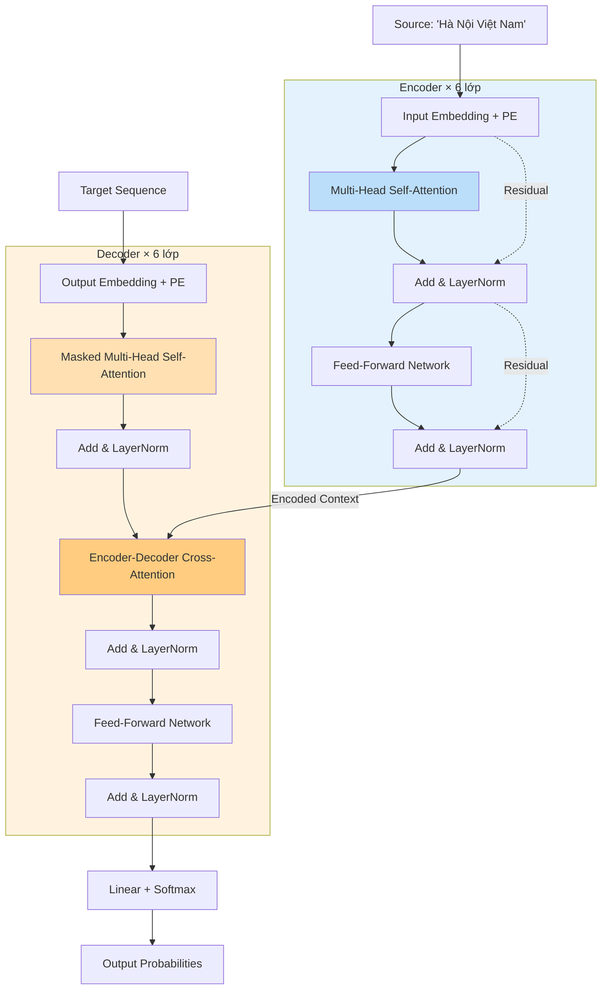

---

### Hình 3.2 — `fig:phobert-ner` → lưu `figs/fig-phobert-ner.png`

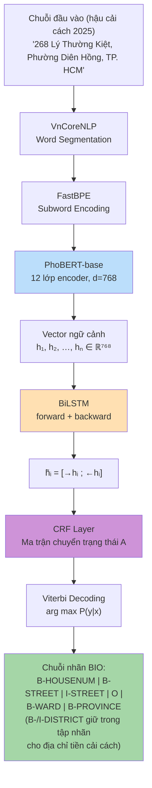

---

### Hình 3.3 — `fig:retrieval-arch` → lưu `figs/fig-retrieval-arch.png`

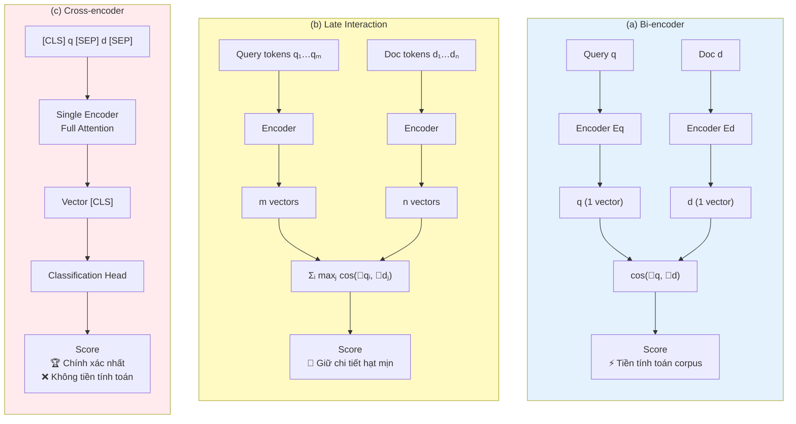

---

### Hình 3.4 — `fig:siamese-triplet` → lưu `figs/fig-siamese-triplet.png`

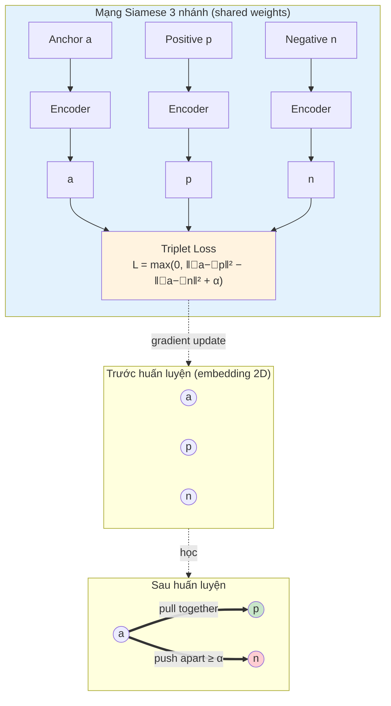

---

### Hình 3.5 — `fig:ray-casting` → lưu `figs/fig-ray-casting.png`

> **Khuyến nghị**: Mermaid khó vẽ thuần hình học. Block dưới là flowchart **giải thích thuật toán** Ray Casting. Phần *hình* (điểm trong/ngoài polygon) nên vẽ bằng **draw.io** hoặc **TikZ** cho đẹp hơn.

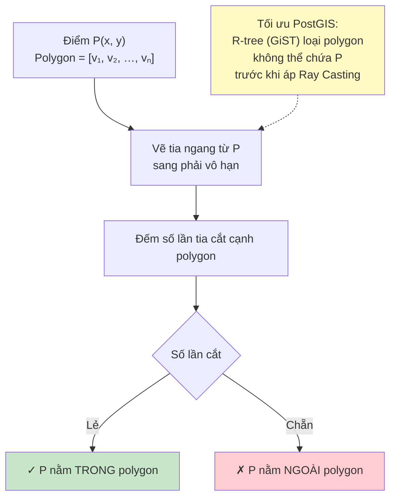

---

### Hình 3.6 — `fig:polygon-strategies` → lưu `figs/fig-polygon-strategies.png`

> **Khuyến nghị tương tự**: phần geometric (polygon thật) nên vẽ trong draw.io. Block dưới là **flowchart logic 3 chiến lược**.

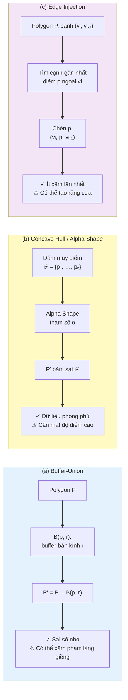

---

### Hình 3.7 — `fig:acs-decision` → lưu `figs/fig-acs-decision.png`

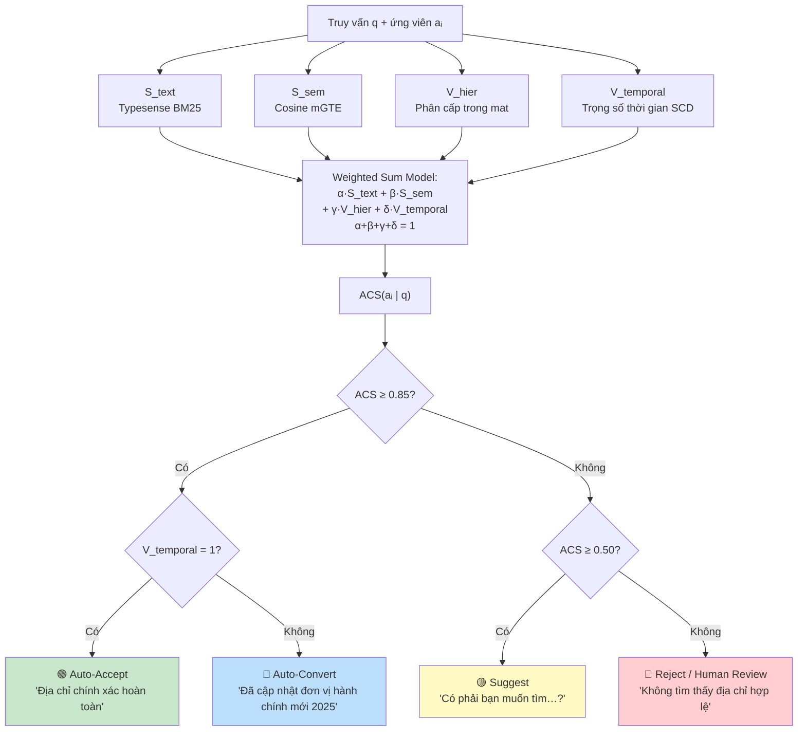

---

## CHƯƠNG 4 — THIẾT KẾ KHUNG GIẢI PHÁP

### Hình 4.1 — `fig:layered-arch` → lưu `figs/fig-layered-arch.png`

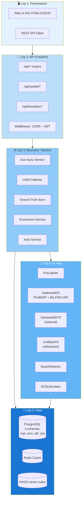

---

### Hình 4.2 — `fig:repo-structure` → lưu `figs/fig-repo-structure.png`

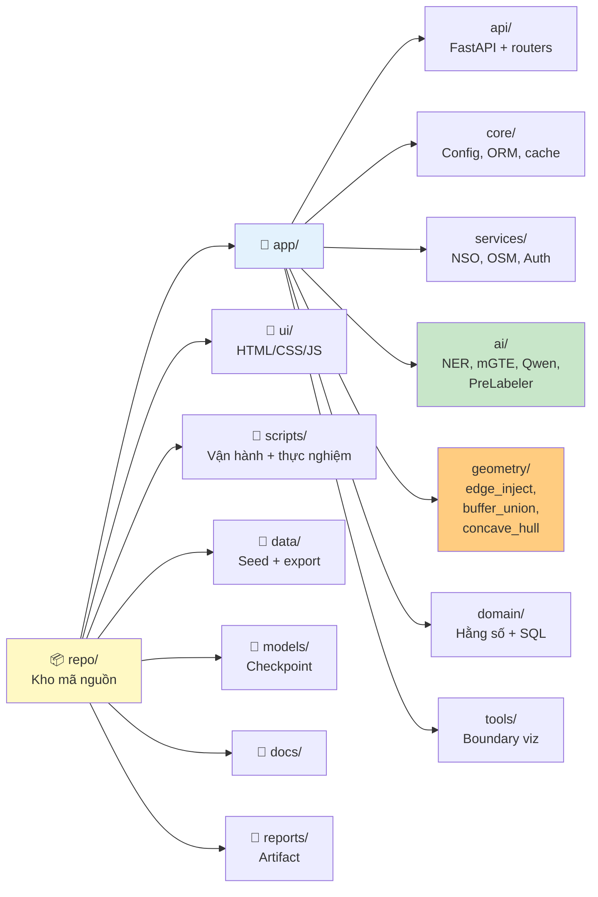

---

### Hình 4.3 — `fig:erd-schema` → lưu `figs/fig-erd-schema.png`

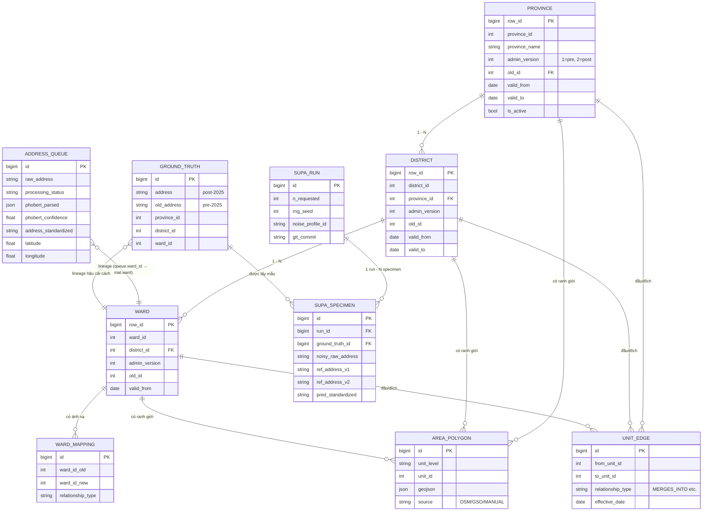

---

### Hình 4.4 — `fig:gov-sync-workflow` → lưu `figs/fig-gov-sync-workflow.png`

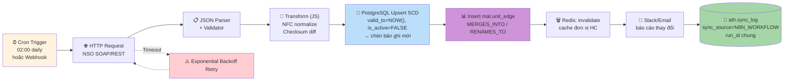

---

### Hình 4.5 — `fig:hybrid-v1-pipeline` → lưu `figs/fig-hybrid-v1-pipeline.png`

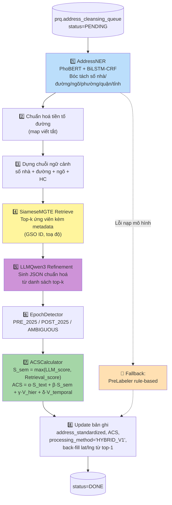

---

### Hình 4.6 — `fig:waterfall-enrichment` → lưu `figs/fig-waterfall-enrichment.png`

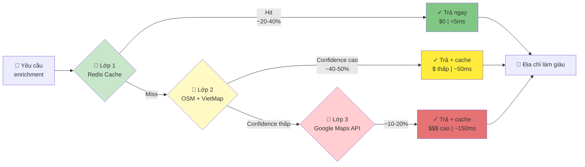

---

### Hình 4.7 — `fig:supa-workflow` → lưu `figs/fig-supa-workflow.png`

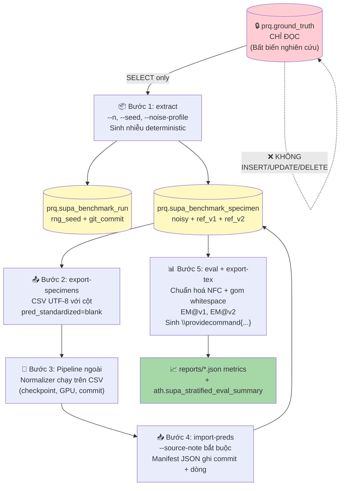

---

## CHƯƠNG 5 — THỰC NGHIỆM

### Hình 5.1 — `fig:audit-distribution` → lưu `figs/fig-audit-distribution.png`

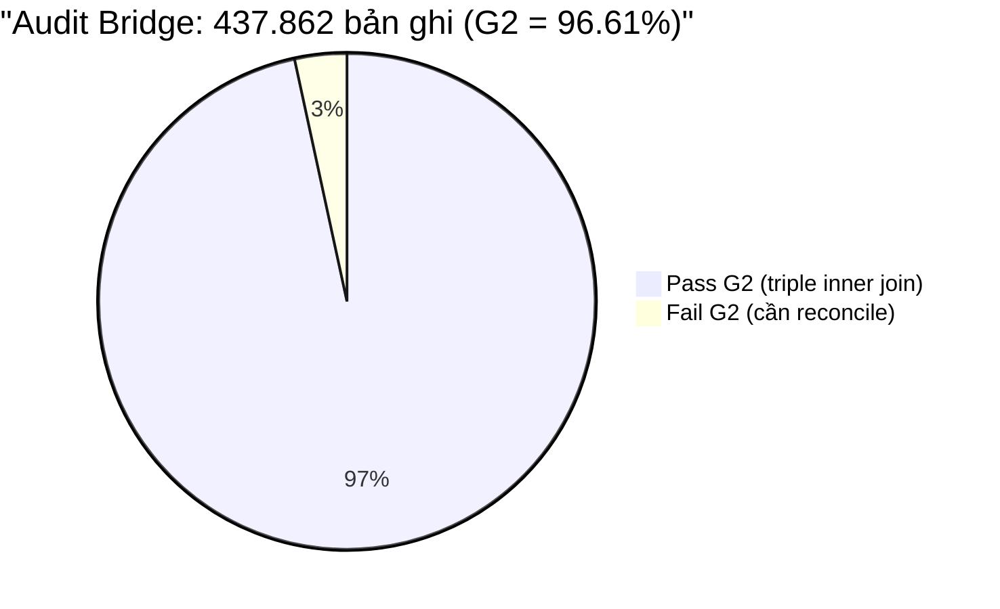

**Hoặc** dùng version 2-cổng:

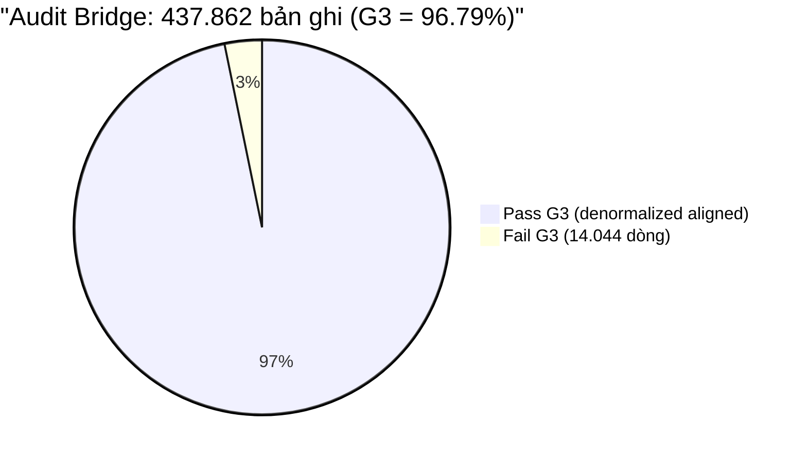

---

### Hình 5.2 — `fig:strata-distribution` → lưu `figs/fig-strata-distribution.png`

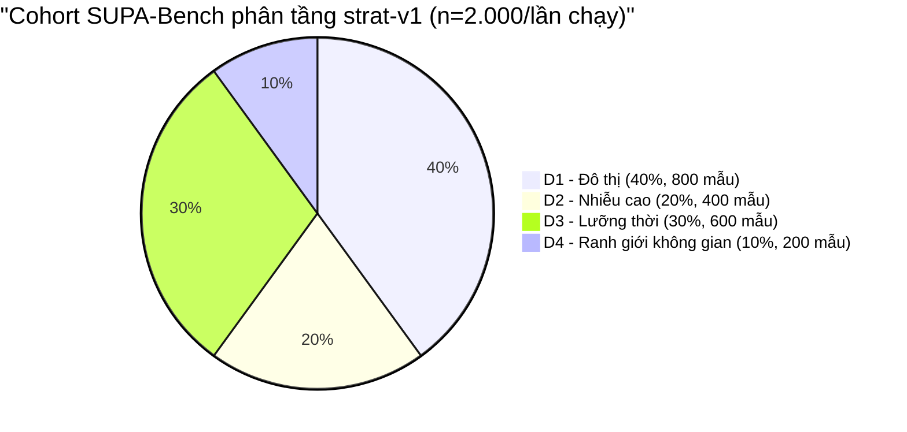

---

### Hình 5.3 — `fig:emv1-k5` → lưu `figs/fig-emv1-k5.png`

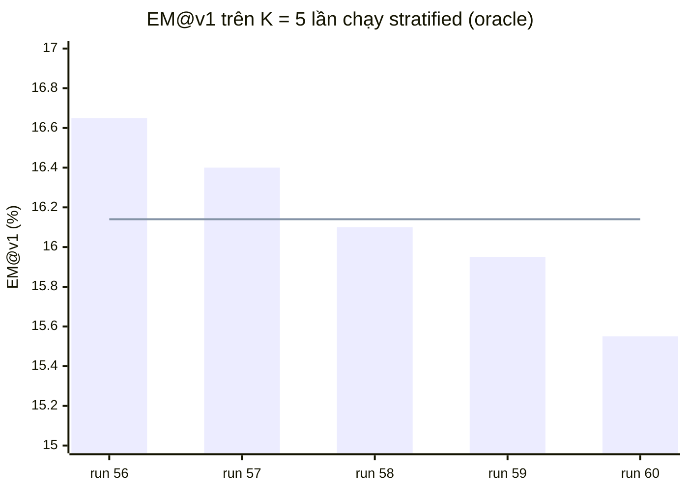

> **Lưu ý**: `xychart-beta` là tính năng experimental của Mermaid, cần phiên bản ≥ 10.6. Trên mermaid.live → menu *Settings* → chọn `mermaid@latest` để chạy. Các giá trị trên là minh hoạ (mean = 16.14, std ≈ 0.44, min = 15.55, max = 16.65).
>
> **Nếu xychart-beta lỗi**, fallback dùng bar chart đơn giản hoặc vẽ tay bằng Python matplotlib và lưu PNG.

---

## 📋 BẢNG TỔNG HỢP — TÊN FILE & VỊ TRÍ TRONG LUẬN VĂN

| # | Label LaTeX | File PNG | Chương | Mục dùng |
|---|---|---|---|---|
| 1 | `fig:transformer-arch` | `figs/fig-transformer-arch.png` | Ch3 | §3.2 Transformer |
| 2 | `fig:phobert-ner` | `figs/fig-phobert-ner.png` | Ch3 | §3.3 PhoBERT NER |
| 3 | `fig:retrieval-arch` | `figs/fig-retrieval-arch.png` | Ch3 | §3.4 mGTE retrieval |
| 4 | `fig:siamese-triplet` | `figs/fig-siamese-triplet.png` | Ch3 | §3.5 Siamese |
| 5 | `fig:ray-casting` | `figs/fig-ray-casting.png` | Ch3 | §3.6 PostGIS PIP |
| 6 | `fig:polygon-strategies` | `figs/fig-polygon-strategies.png` | Ch3 | §3.6 Polygon adj. |
| 7 | `fig:acs-decision` | `figs/fig-acs-decision.png` | Ch3 | §3.7 ACS |
| 8 | `fig:layered-arch` | `figs/fig-layered-arch.png` | Ch4 | §4.2 Kiến trúc |
| 9 | `fig:repo-structure` | `figs/fig-repo-structure.png` | Ch4 | §4.2 Mã nguồn |
| 10 | `fig:erd-schema` | `figs/fig-erd-schema.png` | Ch4 | §4.3 CSDL |
| 11 | `fig:gov-sync-workflow` | `figs/fig-gov-sync-workflow.png` | Ch4 | §4.4 Gov-Sync |
| 12 | `fig:hybrid-v1-pipeline` | `figs/fig-hybrid-v1-pipeline.png` | Ch4 | §4.5 AI Pipeline |
| 13 | `fig:waterfall-enrichment` | `figs/fig-waterfall-enrichment.png` | Ch4 | §4.7 Enrichment |
| 14 | `fig:supa-workflow` | `figs/fig-supa-workflow.png` | Ch4 | §4.9 SUPA-Bench |
| 15 | `fig:audit-distribution` | `figs/fig-audit-distribution.png` | Ch5 | §5.3 Audit |
| 16 | `fig:strata-distribution` | `figs/fig-strata-distribution.png` | Ch5 | §5.4 Phân tầng |
| 17 | `fig:emv1-k5` | `figs/fig-emv1-k5.png` | Ch5 | §5.4 K=5 results |

---

## 🛠 QUY TRÌNH ĐỀ XUẤT — TỪ MERMAID SANG PNG TRONG LUẬN VĂN

### Bước 1: Render Mermaid → PNG
1. Mở https://mermaid.live trong trình duyệt.
2. Copy code Mermaid (chỉ phần trong ```` ```mermaid ... ``` ````) → paste vào panel trái.
3. Menu trên cùng → *Actions* → *PNG* (hoặc SVG cho chất lượng cao hơn) → tải về.
4. Đổi tên file theo bảng ở trên (ví dụ `fig-phobert-ner.png`) → save vào `figs/`.

### Bước 2: Thay placeholder bằng include hình
Trong file `.tex` tương ứng, tìm khối:

```latex
\fbox{\begin{minipage}{0.92\linewidth}\centering\vspace{1.4cm}\textit{[Hình ...]}\vspace{1.4cm}\end{minipage}}
```

→ Thay bằng:

```latex
\includegraphics[width=0.9\linewidth]{figs/fig-phobert-ner.png}
```

Caption và label giữ nguyên — không cần đổi.

### Bước 3: Compile lại
`xelatex` hoặc `pdflatex` rồi `bibtex` → 2 lần `latex` để cập nhật DS hình. DS hình sẽ tự sinh từ `\listoffigures` đã bật trong TOC.

---

## 💡 TIPS TINH CHỈNH

- **Đổi màu nhanh**: chỉnh `fill:#XXXXXX` trong dòng `style` cuối mỗi block.
- **Theme tối**: trên mermaid.live → *Theme* → chọn `dark`. Lưu ý màu chữ.
- **Phông chữ Việt**: mermaid.live render UTF-8 tốt; không cần config.
- **Sửa text**: ký tự đặc biệt trong Mermaid (như `(`, `)`, `[`, `]`) phải nằm trong `"..."`.
- **Hình quá rộng**: chỉnh `direction LR` thành `TB` (hoặc ngược lại) để xoay layout.
- **Hình bị cắt**: thêm whitespace + `\<br/>` để xuống dòng tự nhiên.

---

**Sinh bởi**: VNAI thesis project, phiên bản đồng bộ với commit cuối cùng của `chapters/` folder.
